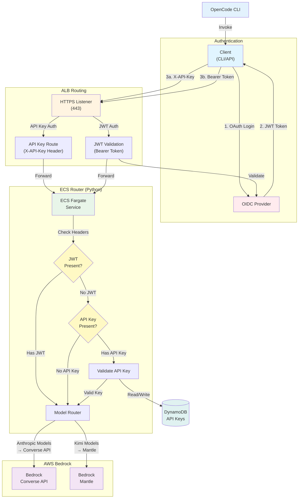

# OpenCode Stack

A streamlined, ECS-based infrastructure for serving Kimi K2.5 and Claude models (Opus 4.6, Sonnet 4.5) via AWS Bedrock.

## Architecture Overview



## Key Features

- **ECS Fargate**: Containerized router service (no EC2 management)
- **Multi-Model Support**: Kimi K2.5, Claude Opus 4.6, and Claude Sonnet 4.5 via Bedrock
- **Dual Routing**: Bedrock Converse API for Anthropic models, Bedrock Mantle for others
- **Dual ALB Setup**: JWT validation for API, OIDC for browser traffic
- **API Key Authentication**: Long-lived keys for CI/CD and automation (no browser required)
- **Structured Logging**: JSON logs for CloudWatch Insights
- **Auto-Scaling**: 1-3 tasks based on CPU utilization

## Project Structure

```
opencode-stack/
├── src/
│   ├── main.ts                       # CDK app entry point
│   ├── stacks/
│   │   ├── network-stack.ts          # VPC, subnets, networking
│   │   ├── shared-certificate-stack.ts # ACM certificates
│   │   ├── auth-stack.ts              # OIDC auth (Cognito or external)
│   │   ├── api-stack.ts              # ECS service, ALB, JWT
│   │   └── distribution-stack.ts     # Distribution landing page
│   ├── constructs/
│   │   ├── vpc-endpoints-construct.ts  # Bedrock VPC endpoints
│   │   └── alb-security-group-construct.ts # ALB security group
│   └── types/
│       └── index.ts                  # Shared TypeScript types
├── services/
│   ├── router/
│   │   ├── main.py                   # Bedrock proxy service
│   │   ├── Dockerfile
│   │   └── requirements.txt
│   └── distribution/
│       ├── lambda/
│       │   └── index.py              # Landing page handler
│       └── assets/                   # Client binaries
│           ├── opencode-auth-*       # Auth CLI binaries
│           ├── install.sh
│           └── opencode.json
├── auth/
│   └── opencode-auth/                # Go-based auth CLI
│       ├── main.go
│       ├── auth/                     # Authentication logic
│       ├── apikey/                   # API key management client
│       └── proxy/                    # Proxy server
└── scripts/
    └── deploy.sh                     # Deployment script
```

## Prerequisites

- AWS CLI configured (see [AWS Configuration](#aws-configuration))
- Node.js 18+
- AWS CDK CLI: `npm install -g aws-cdk`
- Docker or Finch (for building container images)

## AWS Configuration

Configure AWS credentials using one of the following methods:

**Option 1: AWS SSO (Recommended)**
```bash
aws configure sso
aws sso login --profile your-profile
export AWS_PROFILE=your-profile
```

**Option 2: Environment Variables**
```bash
export AWS_ACCESS_KEY_ID=your_access_key
export AWS_SECRET_ACCESS_KEY=your_secret_key
export AWS_REGION=us-east-1
```

**Option 3: IAM Role (EC2/ECS/Lambda)**
Credentials are automatically provided via the instance metadata service.

## Quick Start

### 1. Install Dependencies

```bash
npm install
```

### 2. Configure AWS Credentials

```bash
# Configure credentials (see AWS Configuration section above)
aws configure
# or
export AWS_PROFILE=your-profile
```

### 3. Deploy (Automated)

Use the deployment script for a fully automated deployment:

```bash
# Deploy everything
./scripts/deploy.sh

# Or deploy specific phases
./scripts/deploy.sh phase1  # Foundation
./scripts/deploy.sh phase4  # Router only
```

See [scripts/README.md](scripts/README.md) for detailed usage.

**Note:** The OIDC ALB client secret is created automatically when you run `./scripts/deploy.sh auth` (Cognito mode). For external OIDC providers, `./scripts/setup.sh` handles secret creation during the interactive setup.

### 4. Deploy (Manual)

If you prefer manual deployment:

```bash
# Build CDK
npm run build

# Bootstrap (first time only)
npx cdk bootstrap aws://YOUR_ACCOUNT_ID/us-east-1

# Deploy all stacks
npx cdk deploy --all

# Or deploy specific stacks (in order)
npx cdk deploy OpenCodeNetwork-dev      # Phase 1: VPC
npx cdk deploy OpenCodeCertificate-dev  # Phase 1: Certificate
npx cdk deploy OpenCodeAuth-dev          # Phase 2: Auth
npx cdk deploy OpenCodeApi-dev          # Phase 3: API/Router
npx cdk deploy OpenCodeDistribution-dev # Phase 4: Distribution
```

### 5. Build and Push Router Image

Using Docker (default):
```bash
cd services/router
docker build -t bedrock-router .
aws ecr get-login-password | docker login --username AWS --password-stdin 123456789012.dkr.ecr.us-east-1.amazonaws.com
docker tag bedrock-router:latest 123456789012.dkr.ecr.us-east-1.amazonaws.com/bedrock-router-dev:latest
docker push 123456789012.dkr.ecr.us-east-1.amazonaws.com/bedrock-router-dev:latest
```

Using Finch:
```bash
cd services/router
finch build -t bedrock-router .
aws ecr get-login-password | finch login --username AWS --password-stdin 123456789012.dkr.ecr.us-east-1.amazonaws.com
finch tag bedrock-router:latest 123456789012.dkr.ecr.us-east-1.amazonaws.com/bedrock-router-dev:latest
finch push 123456789012.dkr.ecr.us-east-1.amazonaws.com/bedrock-router-dev:latest
```

## Configuration

### Environment Variables (Router)

| Variable | Default | Description |
|----------|---------|-------------|
| `PORT` | 8080 | HTTP server port |
| `LOG_LEVEL` | INFO | Logging level (DEBUG, INFO, WARN, ERROR) |
| `BEDROCK_MANTLE_URL` | https://bedrock-mantle.us-east-1.api.aws | Bedrock Mantle endpoint |
| `BEDROCK_MODEL_MAP` | - | JSON string for model mapping |
| `API_KEYS_TABLE_NAME` | - | DynamoDB table name for API key storage |

### CDK Context

Set in `cdk.json` or via command line:

```json
{
  "context": {
    "environment": "dev",
    "hostedZoneId": "Z0123456789ABCDEFGHIJ",
    "hostedZoneName": "example.com",
    "certificateDomain": "*.oc.example.com",
    "apiDomain": "oc.example.com",
    "webDomain": "downloads.oc.example.com"
  }
}
```

## API Endpoints

### Health Checks

- `GET /health` - Basic health check (returns HTTP 200)
- `GET /ready` - Deep health check (validates Bedrock token generation)

### OpenAI-Compatible API

- `GET /v1/models` - List available models
- `POST /v1/chat/completions` - Chat completions (streaming supported)

### API Key Management (JWT required)

- `POST /v1/api-keys` - Create a new API key
- `GET /v1/api-keys` - List your API keys
- `DELETE /v1/api-keys/{key_prefix}` - Revoke an API key

### Example Request

```bash
# Kimi K2.5
curl -X POST https://oc.example.com/v1/chat/completions \
  -H "Authorization: Bearer YOUR_JWT_TOKEN" \
  -H "Content-Type: application/json" \
  -d '{
    "model": "kimi-k25",
    "messages": [{"role": "user", "content": "Hello!"}]
  }'

# Claude Opus 4.6
curl -X POST https://oc.example.com/v1/chat/completions \
  -H "Authorization: Bearer YOUR_JWT_TOKEN" \
  -H "Content-Type: application/json" \
  -d '{
    "model": "claude-opus",
    "messages": [{"role": "user", "content": "Hello!"}]
  }'

# Claude Sonnet 4.5
curl -X POST https://oc.example.com/v1/chat/completions \
  -H "Authorization: Bearer YOUR_JWT_TOKEN" \
  -H "Content-Type: application/json" \
  -d '{
    "model": "claude-sonnet",
    "messages": [{"role": "user", "content": "Hello!"}]
  }'

# Using API Key (for CI/CD and automation)
curl -X POST https://oc.example.com/v1/chat/completions \
  -H "X-API-Key: oc_YOUR_API_KEY" \
  -H "Content-Type: application/json" \
  -d '{
    "model": "claude-opus",
    "messages": [{"role": "user", "content": "Hello!"}]
  }'
```

## Model Support

### Supported Models

| Model | Alias | Context Window | Features |
|-------|-------|----------------|----------|
| **Kimi K2.5** | `kimi-k25` | 256K tokens | Text, Image, Tool calling |
| **Claude Opus 4.6** | `claude-opus` | 200K tokens | Text, Image, Reasoning, Tool calling, Prompt caching |
| **Claude Sonnet 4.5** | `claude-sonnet` | 200K tokens | Text, Image, Reasoning, Tool calling, Prompt caching |

### Model Routing

The router automatically detects the target model and routes to the appropriate backend:

- **Anthropic models** (Claude Opus/Sonnet): Use Bedrock Converse API via boto3 with automatic [prompt caching](docs/ROUTER.md#prompt-caching)
- **Other models** (Kimi): Use Bedrock Mantle proxy

Both routes return OpenAI-compatible responses.

## Authentication

### JWT Flow (API/CLI)

1. Client obtains JWT from Cognito via `opencode-auth login`
2. ALB validates JWT via JWKS endpoint
3. Request forwarded to ECS router
4. Router uses IAM role to generate Bedrock tokens

For detailed JWT validation documentation, see [JWT Validation Guide](docs/JWT-VALIDATION.md).

### API Key Flow (CI/CD/Automation)

1. User creates API key via `opencode-auth apikey create` (requires prior JWT auth)
2. Client sends `X-API-Key: oc_...` header with requests
3. ALB forwards to ECS router (no JWT validation for API key requests)
4. Router validates key hash against DynamoDB, then routes normally

API keys are ideal for headless environments that can't perform browser-based OAuth flows. Keys are tied to user identity, expire after 1-365 days, and can be managed via the CLI.

```bash
# Create and save an API key
opencode-auth apikey create --description "CI pipeline" --expires-in-days 90 --save

# Restart proxy to use the new key
opencode-auth proxy restart

# All proxy traffic now authenticates with the API key automatically
```

### OIDC Flow (Browser)

1. User authenticates via Cognito
2. Cognito federates to your Identity Provider
3. ALB manages OIDC session
4. User can access distribution landing page

## Monitoring

### CloudWatch Logs

- Log Group: `/ecs/bedrock-router-{environment}`
- Format: Structured JSON
- Fields: `timestamp`, `level`, `message`, `request_id`, `duration_ms`

### CloudWatch Metrics

- ECS CPU/Memory utilization
- ALB request count/latency
- Bedrock token refresh events

## Development

### Local Testing

```bash
cd services/router
pip install -r requirements.txt
python main.py
```

### Running Tests

```bash
npm test
```

### CDK Commands

```bash
# Synthesize CloudFormation
npx cdk synth

# Diff changes
npx cdk diff

# Deploy specific stack
npx cdk deploy OpenCodeApi-dev

# Destroy stack
npx cdk destroy OpenCodeApi-dev
```

## Deployment Strategy

### Phase 1: Foundation ✅
- [x] VPC and networking (NetworkStack)
- [x] ACM certificates (SharedCertificateStack)
- [x] ECS cluster and ECR repository
- [x] IAM roles and permissions

### Phase 2: Authentication & API ✅
- [x] Cognito user pool with OIDC IdP (CognitoStack)
- [x] JWT ALB integration (ApiStack)
- [x] ECS Fargate service with Bedrock proxy
- [x] Target groups and listener rules

### Phase 3: Distribution ✅
- [x] Distribution service with Lambda
- [x] Landing page for downloads
- [x] OIDC ALB for browser auth
- [x] S3 bucket for assets

### Phase 4: Local Auth Tools ✅
- [x] opencode-auth CLI (Go-based)
- [x] Client configuration
- [x] Multi-platform binaries
- [x] Documentation

**Current Status:** All phases complete
**Next:** Testing and optimization

### Share Feature (POC)
- [ ] Lambda-based share API with event-sourcing storage
- [ ] WebSocket real-time updates
- [ ] Standalone HTML viewer with dark mode
- [ ] CloudFormation templates for Lambda + API Gateway + S3 + DynamoDB

See [docs/SHARE-FEATURE.md](docs/SHARE-FEATURE.md) for full details.

## Security

- **IAM Roles**: ECS task role with minimal Bedrock permissions
- **Token Refresh**: 1-hour TTL with automatic refresh
- **Network**: Private subnets, no public IP on tasks
- **Encryption**: HTTPS/TLS for all communications
- **Secrets**: No hardcoded credentials, use IAM roles
- **JWT Validation**: ALB-level JWT validation via JWKS endpoint ([details](docs/JWT-VALIDATION.md))
- **API Keys**: SHA-256 hashed storage, mandatory expiration, max 10 per user

## Cost Optimization

- **ECS Fargate**: Pay per use, scales to zero (min 1 task)
- **ALB**: Shared across services
- **Bedrock**: On-demand pricing, no reserved capacity
- **Estimated Cost**: ~$50-100/month for 50 developers

## Troubleshooting

If you're using [opencode](https://opencode.ai), run `/troubleshoot` for interactive diagnosis or `/jwt-debug` for authentication issues.

### Router Not Starting

Check CloudWatch logs:
```bash
aws logs tail /ecs/bedrock-router-dev --follow
```

### Token Generation Failing

Verify IAM permissions:
```bash
aws iam simulate-principal-policy \
  --policy-source-arn TASK_ROLE_ARN \
  --action-names bedrock:InvokeModel
```

### Health Check Failing

Check `/ready` endpoint manually:
```bash
curl http://localhost:8080/ready
```

## Contributing

1. Create feature branch
2. Make changes
3. Run tests: `npm test`
4. Build: `npm run build`
5. Submit PR

## License

This library is licensed under the MIT-0 License. See the LICENSE file.

## Support

- **Issues**: Create a GitHub issue

---

**Last Updated**: 2026-02-17
