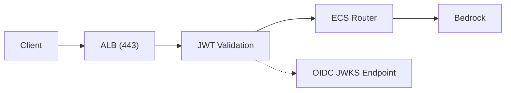

# JWT Validation at ALB

## Overview

The OpenCode stack uses JWT (JSON Web Token) validation at the Application Load Balancer (ALB) level to authenticate API requests before they reach the application. This provides several benefits:

- **Security**: Authentication happens at the edge, before requests reach the application
- **Performance**: Invalid requests are rejected early, reducing load on the ECS service
- **Simplicity**: The application doesn't need to handle JWT validation logic
- **Standardization**: Uses industry-standard JWT validation via JWKS endpoints

## Architecture



**Request Flow:**
1. Client sends request with `Authorization: Bearer <token>` header
2. ALB receives request and checks for Authorization header
3. ALB validates JWT signature using JWKS endpoint
4. ALB verifies token claims (issuer, audience, expiration)
5. If valid, request is forwarded to ECS Router
6. If invalid, ALB returns 401 Unauthorized

## How It Works

### 1. Token Issuance

Before making API calls, users must obtain a JWT access token:

1. User authenticates via `opencode-auth` CLI tool
2. CLI initiates OAuth 2.0 Authorization Code flow with PKCE
3. User logs in via OIDC provider (browser or CLI PKCE flow)
4. Provider issues JWT access token and refresh token
5. CLI stores tokens locally for subsequent requests

### 2. Token Validation

When a client sends an API request:

1. **Request Header**: Client includes `Authorization: Bearer <token>` header
2. **ALB Interception**: ALB listener rule matches requests with Authorization header
3. **Signature Validation**: ALB fetches public keys from JWKS endpoint and validates token signature
4. **Claim Verification**: ALB verifies:
   - **Issuer (`iss`)**: Must match OIDC provider issuer URL
   - **Audience (`aud`)**: Must match CLI Client ID
   - **Expiration (`exp`)**: Token must not be expired
5. **Forwarding**: Valid requests are forwarded to the ECS Router target group
6. **Rejection**: Invalid requests receive HTTP 401 Unauthorized

### 3. JWKS Endpoint

The ALB uses the OIDC provider's JWKS (JSON Web Key Set) endpoint to retrieve public keys for signature validation:

```
https://cognito-idp.{region}.amazonaws.com/{userPoolId}/.well-known/jwks.json
```

**Example:**
```
https://cognito-idp.us-east-1.amazonaws.com/us-east-1_XXXXXXXXX/.well-known/jwks.json
```

The JWKS endpoint returns a JSON object containing public keys in JWK format. The ALB automatically:
- Fetches the JWKS document
- Caches the keys
- Uses the appropriate key (identified by `kid` in the JWT header) to validate signatures

## Token Structure

JWT tokens consist of three parts separated by dots: `header.payload.signature`

### Header

```json
{
  "alg": "RS256",
  "kid": "abc123def456..."
}
```

| Field | Description |
|-------|-------------|
| `alg` | Algorithm used for signing (RS256 = RSA with SHA-256) |
| `kid` | Key ID - identifies which key from JWKS was used |

### Payload (Claims)

```json
{
  "sub": "a1b2c3d4-e5f6-7890-abcd-ef1234567890",
  "email": "user@example.com",
  "email_verified": true,
  "given_name": "John",
  "family_name": "Doe",
  "iss": "https://cognito-idp.us-east-1.amazonaws.com/us-east-1_XXXXXXXXX",
  "aud": "1234567890abcdef1234567890ab",
  "token_use": "access",
  "auth_time": 1708000000,
  "exp": 1708003600,
  "iat": 1708000000,
  "jti": "unique-token-id",
  "username": "user@example.com",
  "origin_jti": "original-token-id"
}
```

| Claim | Description |
|-------|-------------|
| `sub` | Subject - unique user identifier (UUID) |
| `email` | User's email address |
| `email_verified` | Whether email has been verified |
| `given_name` | User's first name |
| `family_name` | User's last name |
| `iss` | Issuer - OIDC provider URL |
| `aud` | Audience - must match CLI Client ID |
| `token_use` | Type of token (access/id/refresh) |
| `auth_time` | Unix timestamp when authentication occurred |
| `exp` | Expiration time (Unix timestamp) |
| `iat` | Issued at time (Unix timestamp) |
| `jti` | Unique token identifier |
| `username` | Username (email in this case) |

## CDK Configuration

### JWT Validation Rule

The JWT validation is configured in `src/stacks/api-stack.ts` using a `CfnListenerRule`:

```typescript
// JWT Validation rule (Priority 5) - Bearer token required
const jwtValidationRule = new elbv2.CfnListenerRule(this, 'JwtValidationRule', {
  listenerArn: this.listener.listenerArn,
  priority: 5,
  conditions: [
    {
      field: 'http-header',
      httpHeaderConfig: {
        httpHeaderName: 'Authorization',
        values: ['Bearer*'],
      },
    },
  ],
  actions: [
    {
      type: 'jwt-validation',
      order: 1,
      jwtValidationConfig: {
        jwksEndpoint: oidcJwksUrl,
        issuer: oidcIssuer,
        additionalClaims: [
          {
            name: 'aud',
            values: [oidcCliClientId],
            format: 'single-string',
          },
        ],
      },
    },
    {
      type: 'forward',
      order: 2,
      targetGroupArn: this.targetGroup.targetGroupArn,
    },
  ],
});
```

**Key Configuration:**
- **Priority**: 5 (evaluated after health check rule)
- **Condition**: Requests with `Authorization` header starting with `Bearer`
- **JWKS Endpoint**: Dynamically constructed from SSM parameters
- **Issuer**: OIDC provider URL
- **Audience Claim**: Validates against CLI Client ID

### Health Check Bypass

Health check endpoints bypass JWT validation (Priority 1):

```typescript
// Health check rule (Priority 1) - No auth required
const healthCheckRule = new elbv2.CfnListenerRule(this, 'HealthCheckRule', {
  listenerArn: this.listener.listenerArn,
  priority: 1,
  conditions: [
    {
      field: 'path-pattern',
      pathPatternConfig: {
        values: ['/health', '/health/*', '/ready'],
      },
    },
  ],
  actions: [
    {
      type: 'forward',
      targetGroupArn: this.targetGroup.targetGroupArn,
    },
  ],
});
```

**Unauthenticated Paths:**
- `/health` - Basic health check
- `/health/*` - Detailed health endpoints
- `/ready` - Readiness probe

### API Key Management Rule

API key management endpoints require JWT authentication (Priority 3). This ensures only authenticated users can create or manage API keys:

```typescript
// API key management rule (Priority 3) - JWT required for /v1/api-keys*
const apiKeyManagementRule = new elbv2.CfnListenerRule(this, 'ApiKeyManagementRule', {
  listenerArn: this.listener.listenerArn,
  priority: 3,
  conditions: [
    {
      field: 'path-pattern',
      pathPatternConfig: {
        values: ['/v1/api-keys*'],
      },
    },
    {
      field: 'http-header',
      httpHeaderConfig: {
        httpHeaderName: 'Authorization',
        values: ['Bearer*'],
      },
    },
  ],
  actions: [
    {
      type: 'jwt-validation',
      order: 1,
      jwtValidationConfig: {
        jwksEndpoint: oidcJwksUrl,
        issuer: oidcIssuer,
        additionalClaims: [
          {
            name: 'aud',
            values: [oidcCliClientId],
            format: 'single-string',
          },
        ],
      },
    },
    {
      type: 'forward',
      order: 2,
      targetGroupArn: this.targetGroup.targetGroupArn,
    },
  ],
});
```

### API Key Passthrough Rule

Requests with an `X-API-Key` header bypass ALB-level JWT validation and are forwarded directly to the router for application-level key validation (Priority 10):

```typescript
// API key passthrough rule (Priority 10) - forward to router for validation
const apiKeyPassthroughRule = new elbv2.CfnListenerRule(this, 'ApiKeyPassthroughRule', {
  listenerArn: this.listener.listenerArn,
  priority: 10,
  conditions: [
    {
      field: 'http-header',
      httpHeaderConfig: {
        httpHeaderName: 'X-API-Key',
        values: ['oc_*'],
      },
    },
  ],
  actions: [
    {
      type: 'forward',
      targetGroupArn: this.targetGroup.targetGroupArn,
    },
  ],
});
```

### Complete ALB Rule Priority Chain

| Priority | Rule | Auth | Description |
|----------|------|------|-------------|
| 1 | Health Check | None | `/health`, `/health/*`, `/ready` — forwarded directly |
| 3 | API Key Management | JWT | `/v1/api-keys*` with Bearer token — JWT validated then forwarded |
| 5 | JWT Validation | JWT | Any request with `Authorization: Bearer*` — JWT validated then forwarded |
| 10 | API Key Passthrough | App-level | `X-API-Key: oc_*` — forwarded to router for validation |
| default | Catch-all | — | Returns 401 Unauthorized |

### Auth Stack Configuration

From `src/stacks/auth-stack.ts`, the relevant token configuration (Cognito mode):

```typescript
// Token validity settings
accessTokenValidity: 1,    // 1 hour
idTokenValidity: 1,        // 1 hour
refreshTokenValidity: 12,  // 12 hours
tokenValidityUnits: {
  accessToken: 'hours',
  idToken: 'hours',
  refreshToken: 'hours',
},
```

## Configuration Values

All JWT-related configuration is stored in AWS Systems Manager (SSM) Parameter Store:

| Parameter | Description | Example Value |
|-----------|-------------|---------------|
| `/opencode/{env}/oidc/issuer` | OIDC Issuer URL | `https://cognito-idp.us-east-1.amazonaws.com/...` |
| `/opencode/{env}/oidc/cli-client-id` | CLI Application Client ID | `1234567890abcdef...` |
| `/opencode/{env}/oidc/jwks-url` | JWKS endpoint URL | `https://cognito-idp.us-east-1.amazonaws.com/.../.well-known/jwks.json` |
| `/opencode/{env}/oidc/alb-client-id` | ALB Client ID | `abcdef1234567890...` |
| `/opencode/{env}/oidc/authorization-endpoint` | Authorization Endpoint | `https://.../oauth2/authorize` |

### Retrieving Values

```bash
# Get User Pool ID
aws ssm get-parameter \
  --name /opencode/dev/cognito/user-pool-id \
  --query 'Parameter.Value' \
  --output text

# Get CLI Client ID
aws ssm get-parameter \
  --name /opencode/dev/oidc/cli-client-id \
  --query 'Parameter.Value' \
  --output text

# Get JWKS URL
aws ssm get-parameter \
  --name /opencode/dev/oidc/jwks-url \
  --query 'Parameter.Value' \
  --output text
```

## Verification

### Test JWT Validation

#### 1. Get a Token

```bash
# Using opencode-auth CLI
token=$(opencode-auth token)
echo $token
```

#### 2. Test API with Valid Token

```bash
# Test with token (should succeed)
curl -H "Authorization: Bearer $token" \
  https://oc.example.com/v1/models

# Expected: JSON list of available models
```

#### 3. Test Without Token (Should Fail)

```bash
# Test without token (should return 401)
curl -v https://oc.example.com/v1/models

# Expected: HTTP/1.1 401 Unauthorized
```

#### 4. Test with Invalid Token

```bash
# Test with garbage token (should return 401)
curl -H "Authorization: Bearer invalid_token" \
  https://oc.example.com/v1/models

# Expected: HTTP/1.1 401 Unauthorized
```

### Verify JWKS Endpoint

```bash
# Get JWKS URL from SSM
JWKS_URL=$(aws ssm get-parameter \
  --name /opencode/dev/oidc/jwks-url \
  --query 'Parameter.Value' \
  --output text)

# Fetch JWKS
curl $JWKS_URL | jq .

# Expected: JSON with "keys" array containing JWK objects
```

### Verify Health Check Bypass

```bash
# Health check should work without authentication
curl https://oc.example.com/health

# Expected: {"status":"healthy"} or similar
```

## Debugging

### Common Issues

#### 401 Unauthorized

**Possible Causes:**
- Token expired (check `exp` claim)
- Wrong audience (client ID mismatch)
- Token signature invalid (tampered token)
- Missing Authorization header
- Malformed Authorization header (must be `Bearer <token>`)

**Debug Steps:**
```bash
# 1. Decode token to check expiration
echo $TOKEN | jq -R 'split(".") | .[1] | @base64d | fromjson' | jq '.exp'

# 2. Check current time
 date +%s
 
# 3. Compare - if exp < current time, token is expired
```

#### JWKS Fetch Failure

**Possible Causes:**
- Network connectivity issues
- Wrong user pool ID
- Cognito service issues
- Region mismatch

**Debug Steps:**
```bash
# 1. Verify JWKS URL is accessible
curl -I $(aws ssm get-parameter --name /opencode/dev/oidc/jwks-url --query 'Parameter.Value' --output text)

# 2. Check User Pool exists
aws cognito-idp describe-user-pool \
  --user-pool-id $(aws ssm get-parameter --name /opencode/dev/cognito/user-pool-id --query 'Parameter.Value' --output text)
```

#### Token Works Locally But Not Via ALB

**Possible Causes:**
- ALB using wrong client ID for audience validation
- SSM parameter values don't match deployed resources
- Listener rule priority issues

**Debug Steps:**
```bash
# 1. Verify ALB has correct JWT configuration
aws elbv2 describe-rules \
  --listener-arn $(aws ssm get-parameter --name /opencode/dev/alb/jwt/listener-arn --query 'Parameter.Value' --output text) \
  --query 'Rules[?Priority==`5`].Actions[?Type==`jwt-validation`]'

# 2. Check ALB logs in CloudWatch
aws logs tail "/aws/elb/opencode-jwt-dev" --follow
```

### Debug Commands

#### Decode JWT (without verification)

```bash
# Full decode
echo $TOKEN | jq -R 'split(".") | .[0] | @base64d | fromjson'  # Header
echo $TOKEN | jq -R 'split(".") | .[1] | @base64d | fromjson'  # Payload

# One-liner for payload
echo $TOKEN | jq -R 'split(".") | .[1] | @base64d | fromjson' | jq .

# Check specific claims
echo $TOKEN | jq -R 'split(".") | .[1] | @base64d | fromjson' | jq -r '.exp, .aud, .iss'
```

#### Check Token Expiration

```bash
# Get expiration timestamp
EXP=$(echo $TOKEN | jq -R 'split(".") | .[1] | @base64d | fromjson' | jq -r '.exp')
NOW=$(date +%s)

# Calculate time remaining
REMAINING=$((EXP - NOW))
if [ $REMAINING -gt 0 ]; then
  echo "Token expires in $((REMAINING / 60)) minutes"
else
  echo "Token expired $((-REMAINING / 60)) minutes ago"
fi
```

#### Verify ALB Configuration

```bash
# Get listener ARN
LISTENER_ARN=$(aws ssm get-parameter \
  --name /opencode/dev/alb/jwt/listener-arn \
  --query 'Parameter.Value' \
  --output text)

# List all rules
aws elbv2 describe-rules --listener-arn $LISTENER_ARN --query 'Rules[*].[Priority,Conditions[0].Field,Actions[0].Type]' --output table

# Get detailed JWT validation config
aws elbv2 describe-rules --listener-arn $LISTENER_ARN \
  --query 'Rules[?Priority==`5`].Actions[?Type==`jwt-validation`].[JwtValidationConfig]'
```

#### Check ALB Access Logs

```bash
# Tail ALB logs (if enabled)
aws logs tail "/aws/elb/opencode-jwt-dev" --since 1h

# Search for 401 errors
aws logs filter-log-events \
  --log-group-name "/aws/elb/opencode-jwt-dev" \
  --filter-pattern '" 401 "' \
  --limit 10
```

## Security Considerations

### Token Lifetime

- **Access Tokens**: 1 hour validity
- **ID Tokens**: 1 hour validity  
- **Refresh Tokens**: 12 hours validity

**Best Practices:**
- Store tokens securely (use OS keychain when available)
- Implement token refresh before expiration
- Never log or expose tokens in error messages
- Use HTTPS for all token transmissions

### Claims Validation

The ALB validates these claims:
- **Signature**: Ensures token hasn't been tampered with
- **Issuer (`iss`)**: Ensures token came from expected OIDC provider
- **Audience (`aud`)**: Ensures token is intended for the CLI client
- **Expiration (`exp`)**: Ensures token hasn't expired

### HTTPS Requirement

- All API endpoints require HTTPS
- Tokens are never transmitted over HTTP
- ALB redirects HTTP to HTTPS automatically

### Access Control

While JWT validation ensures authentication, authorization is handled separately:
- Currently: All authenticated users have full access
- Future: Could use claims (e.g., `groups`, custom attributes) for authorization decisions

## Alternative: API Key Authentication

For CI/CD pipelines and automation tools that cannot perform interactive browser-based OAuth flows, the platform also supports **API key authentication**. API keys provide long-lived, programmatic access tied to a user's OIDC identity.

- Keys are created via `opencode-auth apikey create` (requires prior JWT authentication)
- Requests use the `X-API-Key` header instead of `Authorization: Bearer`
- ALB forwards API key requests to the router for application-level validation
- Keys are SHA-256 hashed in DynamoDB (never stored in plaintext)

## Related Documentation

- [OIDC Setup Guide](./OIDC_SETUP.md) - Configuring the OIDC identity provider
- [Deployment Checklist](./DEPLOYMENT_CHECKLIST.md) - Complete deployment guide

## References

- [ALB JWT Validation](https://docs.aws.amazon.com/elasticloadbalancing/latest/application/listener-authenticate-users.html#jwt-validation) - AWS Documentation
- [OIDC JWKS Endpoint](https://docs.aws.amazon.com/cognito/latest/developerguide/amazon-cognito-user-pools-using-tokens-verifying-a-jwt.html) - AWS Documentation
- [JWT.io](https://jwt.io/) - JWT debugger and documentation
- [RFC 7519](https://tools.ietf.org/html/rfc7519) - JWT Specification

---

**Last Updated**: 2026-02-17  
**Applies to**: opencode project
