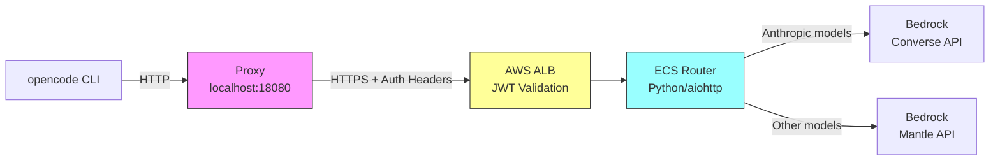
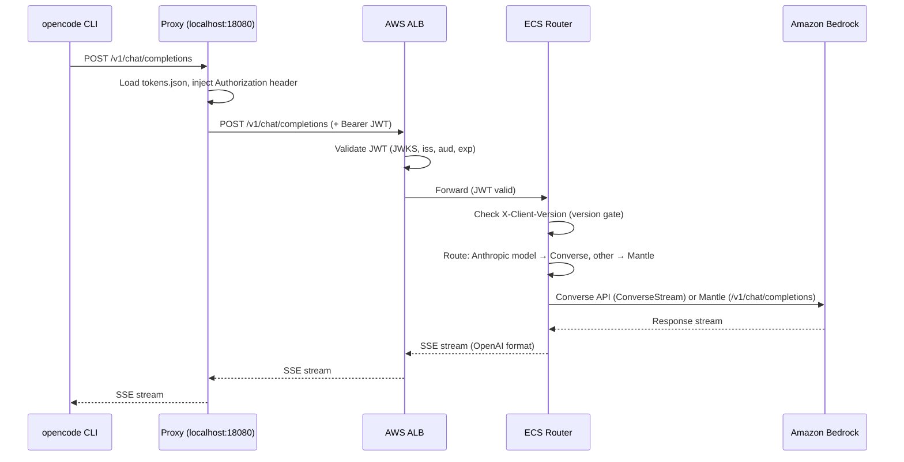

# Local Authentication Proxy

The `opencode-auth` proxy is a local Go binary that sits between the opencode CLI and the deployed AWS infrastructure. It transparently handles OAuth token injection, background token refresh, automatic re-authentication, and dual auth modes (JWT vs API key) so that the unmodified opencode binary can communicate with a Cognito-protected backend.

## Table of Contents

- [Why the Proxy Exists](#why-the-proxy-exists)
- [Architecture Overview](#architecture-overview)
- [Token Lifecycle](#token-lifecycle)
- [Dual Auth Modes](#dual-auth-modes)
- [Daemon Management](#daemon-management)
- [Configuration](#configuration)
- [Troubleshooting](#troubleshooting)
- [Related Documentation](#related-documentation)

---

## Why the Proxy Exists

opencode speaks the standard [OpenAI Chat Completions API](https://platform.openai.com/docs/api-reference/chat) protocol. It knows how to send requests to a `baseURL` with an optional API key, but it has no built-in awareness of:

- **Cognito JWTs** -- the ID tokens issued by Amazon Cognito that authenticate requests at the ALB
- **PKCE OAuth flows** -- the browser-based login flow required to obtain those tokens
- **Token refresh** -- silently obtaining new tokens before the 1-hour expiry
- **Re-authentication** -- handling the 12-hour refresh token expiry by reopening the browser

The proxy bridges this gap without modifying the opencode binary. It works by:

1. **Listening locally** on `localhost:18080` as a reverse proxy
2. **Intercepting every request** from opencode and injecting the appropriate auth header (`Authorization: Bearer <jwt>` or `X-API-Key`)
3. **Forwarding requests** to the remote ALB with credentials attached
4. **Managing the token lifecycle** in the background -- refreshing tokens every ~10 minutes and re-authenticating when the refresh token expires

From opencode's perspective, it's just talking to a local HTTP server. All authentication complexity is hidden behind the proxy.

```
opencode.json:
  "baseURL": "http://localhost:18080/v1"   <-- points to the proxy, not the remote API
```

> **Source**: [`auth/opencode-auth/proxy/server.go:114-117`](../auth/opencode-auth/proxy/server.go) -- the `addAuthHeader` director function that intercepts requests

---

## Architecture Overview

### Request Flow



The proxy injects `Authorization: Bearer <jwt>` (or `X-API-Key`), plus `X-Client-Version` on every outbound request.

### Detailed Sequence (Converse path)



### Router Model Routing

The ECS router translates OpenAI-format requests into the appropriate Bedrock API:

| Model type | Route | How it works |
|------------|-------|--------------|
| Anthropic (Claude) | **Converse API** | Router translates OpenAI messages to Converse format, calls `bedrock.converse_stream()` directly, translates response back to OpenAI SSE format |
| All other models | **Mantle API** | Router forwards the OpenAI-format request as-is to [Bedrock Mantle](https://bedrock-mantle.us-east-1.api.aws) (`/v1/chat/completions`), which handles the model-specific translation |

> **Source**: [`services/router/main.py:1423-1456`](../services/router/main.py) -- routing decision and Mantle forwarding

### ALB Listener Rules

The ALB evaluates requests against a priority chain of rules. The first matching rule wins:

| Priority | Condition | Auth | Purpose |
|----------|-----------|------|---------|
| 1 | Path: `/health`, `/health/*`, `/ready` | None | Health checks |
| 2 | Path: `/v1/update/*` | None | Self-update (must work with expired tokens) |
| 3 | Path: `/v1/api-keys*` + Header: `Authorization: Bearer*` | JWT validated | API key management (always requires JWT) |
| 5 | Header: `Authorization: Bearer*` | JWT validated | Standard API requests with JWT |
| 10 | Header: `X-API-Key: oc_*` | App-level | API key requests (validated by router, not ALB) |
| Default | Everything else | -- | **403 Forbidden** |

> **Source**: [`src/stacks/api-stack.ts:430-579`](../src/stacks/api-stack.ts) -- ALB listener rule definitions

### Proxy Local Endpoints

The proxy also exposes local-only endpoints for coordination with the CLI:

| Endpoint | Method | Response |
|----------|--------|----------|
| `/health` | GET | Proxy health, token info, refresher state |
| `/api/token` | GET | Current valid JWT (or error) |
| `/api/token/status` | GET | Token validity, expiry, reauth state |
| `/api/auth/ensure` | POST | Trigger refresh/reauth if needed |

**Example `/health` response** (from a live instance):

```json
{
  "status": "healthy",
  "port": 18080,
  "target": "https://oc.example.com",
  "timestamp": "2026-02-20T03:23:24Z",
  "refresher": {
    "running": true,
    "last_refresh": "2026-02-19T21:22:54Z",
    "retry_count": 0,
    "needs_reauth": false,
    "reauth_in_progress": false,
    "token": {
      "email": "user@example.com",
      "expires_at": "2026-02-19T21:40:57Z",
      "expires_in": "17m32s",
      "is_expired": false,
      "is_expiring": false
    }
  }
}
```

---

## Token Lifecycle

### 1. Initial Login (PKCE OAuth)

When you first run `oc` (or `opencode-auth login`), the proxy performs a [PKCE](https://oauth.net/2/pkce/) authorization code flow:

```
1. Generate PKCE verifier    32 random bytes -> base64url
2. Generate PKCE challenge   SHA-256(verifier) -> base64url
3. Generate state            16 random bytes (CSRF protection)
4. Start callback server     localhost:19876
5. Open browser              -> Cognito /oauth2/authorize
                                (client_id, redirect_uri, scope, state,
                                 code_challenge, code_challenge_method=S256)
6. User authenticates        Browser -> Cognito -> IdP (if federated)
7. Callback received         localhost:19876/callback?code=...&state=...
8. Verify state              Must match step 3
9. Exchange code             POST to token endpoint with code_verifier
10. Receive tokens           id_token, access_token, refresh_token
11. Save to disk             ~/.opencode/tokens.json
```

> **Source**: [`auth/opencode-auth/auth/pkce.go`](../auth/opencode-auth/auth/pkce.go) (PKCE generation), [`auth/opencode-auth/auth/server.go`](../auth/opencode-auth/auth/server.go) (callback server)

### 2. Token Storage

Tokens are stored at `~/.opencode/tokens.json`:

```json
{
  "id_token": "eyJhbGciOiJSUzI1NiIsInR5cCI6IkpXVCJ9...",
  "access_token": "eyJhbGciOiJSUzI1NiIsInR5cCI6IkpXVCJ9...",
  "refresh_token": "eyJjdHkiOiJKV1QiLCJlbmMiOiJBMjU2R0NNIi...",
  "expires_at": "2026-02-19T21:40:57Z",
  "email": "user@example.com"
}
```

**Security measures:**

| Measure | Detail |
|---------|--------|
| Directory permissions | `~/.opencode/` created with `0700` |
| File permissions | `tokens.json` written with `0600` |
| Atomic writes | Write to `.tmp` file, then `os.Rename()` -- readers never see partial data |
| File locking | `tokens.json.lock` via `flock(2)` (Unix) or `LockFileEx` (Windows) |

> **Source**: [`auth/opencode-auth/auth/token.go:57-90`](../auth/opencode-auth/auth/token.go) (SaveTokens with atomic write)

### 3. Background Token Refresh

The proxy runs a background goroutine that keeps tokens fresh:

```
Token issued ─────────────────────────────────────────── Token expires
|                                                        |
0 min          10 min                            55 min  60 min
               ↑ Refresh happens here             ↑ Backup check
               (50 min before expiry)             (55 min since last refresh)
```

**Timing parameters:**

| Parameter | Value | Purpose |
|-----------|-------|---------|
| Check interval | 2 minutes | How often the refresher wakes up |
| Refresh threshold | 50 minutes before expiry | When to refresh (i.e., ~10 min after issuance for 1h tokens) |
| Backup threshold | 55 minutes since last refresh | Safety net if the expiry check is missed |

**Concurrency safety:** The refresher uses a `refreshMu` mutex with a double-check pattern -- after acquiring the lock, it re-reads `tokens.json` to verify another goroutine hasn't already refreshed:

```go
r.refreshMu.Lock()
defer r.refreshMu.Unlock()

// Re-check if token was already refreshed while we waited
freshTokens, err := auth.LoadTokens(r.config.TokenPath)
if err == nil && !freshTokens.IsExpiringSoon(5*time.Minute) {
    return nil  // Already refreshed
}
// ... perform refresh
```

> **Source**: [`auth/opencode-auth/proxy/refresher.go:237-290`](../auth/opencode-auth/proxy/refresher.go) (refreshToken with mutex)

### 4. Error Handling

When a token refresh fails, the error determines the recovery strategy:

| Error Type | Examples | Strategy |
|------------|----------|----------|
| **Permanent** | `invalid_grant`, `invalid refresh token`, `user not found` | Set `needsReauth=true`, trigger browser re-auth immediately |
| **Rate limit** | `429 Too Many Requests`, `rate exceeded` | Exponential backoff: 2 min, 4 min, 8 min (cap: 10 min) |
| **Transient** | Network errors, 5xx responses | Exponential backoff: 30s, 1m, 2m, 4m, 5m (cap: 5 min, max 5 retries) |

After 5 consecutive transient failures, the proxy logs a warning:

```
[proxy] WARNING: Token refresh has failed 5 times.
[proxy] Last error: token refresh failed: ...
[proxy] API calls may fail when token expires.
[proxy] Run 'opencode-auth login' to re-authenticate.
```

> **Source**: [`auth/opencode-auth/proxy/refresher.go:292-351`](../auth/opencode-auth/proxy/refresher.go) (handleRefreshError)

### 5. Automatic Re-authentication

When the refresh token expires (Cognito default: 12 hours), the proxy detects the `invalid_grant` error and automatically:

1. Sets `needsReauth = true` (stops injecting stale tokens)
2. Generates fresh PKCE verifier + state
3. Starts the local callback server on port 19876
4. Opens the browser to the Cognito authorize URL
5. On macOS, sends a desktop notification:
   ```
   "Your session has expired. Please complete login in the browser."
   ```
6. Waits up to 5 minutes for the user to complete auth
7. Exchanges the authorization code for fresh tokens
8. Clears `needsReauth`, resets retry count

```
[proxy] === Re-Authentication Required ===
[proxy] Your session has expired (12-hour limit)
[proxy] Opening browser for authentication...
[proxy] Waiting for authentication (5m0s timeout)...
[proxy] Exchanging authorization code for tokens...
[proxy] === Re-Authentication Successful ===
[proxy] Email: user@example.com
[proxy] Expires: 19 Feb 26 22:40 CST
[proxy] You can continue using opencode
```

During re-auth, the `/api/auth/ensure` endpoint returns `reauth_in_progress` so the CLI can display a waiting state.

> **Source**: [`auth/opencode-auth/proxy/refresher.go:390-498`](../auth/opencode-auth/proxy/refresher.go) (performReauth)

---

## Dual Auth Modes

The proxy supports two authentication modes: JWT tokens for interactive use and API keys for automation.

### JWT Mode (Default)

The standard mode for interactive sessions. The proxy reads `~/.opencode/tokens.json` and sets:

```
Authorization: Bearer <id_token>
```

The ALB validates the JWT at the edge using the JWKS endpoint, checking:
- Signature (RS256 via JWKS)
- Issuer (`iss` claim matches Cognito user pool)
- Audience (`aud` claim matches the CLI client ID)
- Expiry (`exp` claim)

**Token validity:**

| Token | Lifetime |
|-------|----------|
| ID token | 1 hour |
| Access token | 1 hour |
| Refresh token | 12 hours |

### API Key Mode

For CI/CD pipelines and automation where browser-based login isn't possible.

**Creating an API key:**

```bash
# Create a key (requires JWT auth -- you must be logged in)
opencode-auth apikey create --name "ci-pipeline" --ttl 30

# Create and save directly to config
opencode-auth apikey create --name "ci-pipeline" --ttl 30 --save
```

**How it works:**

1. Keys use the format `oc_<random>` (the `oc_` prefix is matched by the ALB rule)
2. The key is SHA-256 hashed before storage in DynamoDB (`opencode-api-keys-{env}` table)
3. The proxy adds `X-API-Key` header instead of `Authorization: Bearer`:
   ```
   X-API-Key: oc_a1b2c3d4e5f6...
   ```
4. The ALB forwards the request (priority 10 rule -- no JWT validation)
5. The ECS router validates the key hash against DynamoDB with an in-memory cache (~5 min TTL)

**Management exception:** API key management endpoints (`/v1/api-keys*`) always require JWT authentication, even when an API key is configured. This prevents key bootstrapping attacks -- you must have a valid interactive session to create, list, or revoke keys.

### Choosing Between Modes

| | JWT | API Key |
|---|---|---|
| **Use case** | Interactive development | CI/CD, automation, scripts |
| **Login required** | Yes (browser) | No (once created) |
| **Token refresh** | Automatic (background) | N/A (keys don't expire until TTL) |
| **Session limit** | 12 hours (then re-auth) | Configurable TTL (1-365 days) |
| **Revocation** | Logout | `opencode-auth apikey revoke` |
| **Validated by** | ALB (JWKS) | ECS Router (DynamoDB) |

> **Source**: [`auth/opencode-auth/proxy/server.go:463-518`](../auth/opencode-auth/proxy/server.go) (addAuthHeader -- mode selection logic)

---

## Daemon Management

The proxy runs as a background daemon process shared by all opencode sessions on the machine.

### Lifecycle

```
oc (or opencode-auth run)
  |
  ├── Check proxy.json -- is a proxy already running?
  │     ├── Yes, PID alive + /health responds → reuse it
  │     ├── Yes, PID alive but unresponsive → kill and restart
  │     └── No (or stale) → start new daemon
  |
  ├── Acquire proxy-startup.lock (flock)
  │     └── Prevents two processes from starting proxy simultaneously
  |
  ├── Fork: exec opencode-auth proxy start --foreground
  │     └── Child runs with OPENCODE_AUTH_PROXY_DAEMON=1
  |
  ├── Wait 500ms for daemon to initialize
  |
  ├── Read proxy.json for port/PID
  |
  └── Launch opencode with baseURL → localhost:18080
```

### State File (`~/.opencode/proxy.json`)

The daemon writes its runtime state on startup:

```json
{
  "port": 18080,
  "pid": 11831,
  "started": "2026-02-19T11:57:48Z",
  "target_url": "https://oc.example.com",
  "client_version": "1.0.2"
}
```

This file is used by subsequent `oc` invocations to discover the running proxy. It is deleted on clean shutdown.

### Shared Instance

Multiple opencode processes share a single proxy daemon:

- The first `oc` invocation starts the daemon
- Subsequent invocations detect the running proxy via `proxy.json` + PID check + `/health` ping
- If the target URL or client version has changed (e.g., after an update), the proxy is restarted
- The `proxy-startup.lock` file prevents race conditions when multiple shells start simultaneously

### Stale Process Cleanup

The proxy guards against stale state:

1. Load `proxy.json` and check if PID is alive (`kill -0` on Unix, `OpenProcess` on Windows)
2. If alive, verify responsiveness via `GET /health` (2-second timeout)
3. If PID alive but unresponsive: send `SIGTERM`, wait 200ms, escalate to `SIGKILL` if needed
4. If PID dead: delete stale `proxy.json`

### CLI Management Commands

```bash
# Check proxy status
opencode-auth proxy status

# Stop the proxy
opencode-auth proxy stop

# Restart (stop + start)
opencode-auth proxy restart
```

> **Source**: [`auth/opencode-auth/proxy/server.go:607-678`](../auth/opencode-auth/proxy/server.go) (StartProxy)

---

## Configuration

The installer creates two configuration files that connect the local proxy to the remote infrastructure.

### `~/.opencode/config.json` -- Proxy Configuration

Contains the OIDC credentials and API endpoint provisioned during deployment:

```json
{
  "client_id": "1djhmhrsr8dgot995rfhi85ujk",
  "api_endpoint": "https://oc.example.com/v1",
  "issuer": "https://cognito-idp.us-east-1.amazonaws.com/us-east-1_abc123",
  "version_check_url": "https://downloads.oc.example.com/version.json"
}
```

| Field | Source | Purpose |
|-------|--------|---------|
| `client_id` | Cognito CLI client (`generateSecret: false`) | PKCE OAuth client (public client, no secret) |
| `api_endpoint` | ALB domain + `/v1` | Where the proxy forwards requests |
| `issuer` | Cognito User Pool URL | OIDC discovery (`.well-known/openid-configuration`) |
| `api_key` | (optional, added by `apikey create --save`) | Switches proxy to API key mode |
| `version_check_url` | (optional) | Endpoint for update notifications |

**Templating:** The config is built from a template during the CDK distribution build:

```json
// Template (services/distribution/assets/opencode-config.json)
{
  "client_id": "{{CLIENT_ID}}",
  "api_endpoint": "https://{{API_DOMAIN}}/v1",
  "issuer": "{{ISSUER}}"
}
```

The distribution Lambda substitutes `{{CLIENT_ID}}`, `{{API_DOMAIN}}`, and `{{ISSUER}}` from CDK environment variables before packaging the installer.

**OIDC Discovery:** When the proxy starts, it fetches `<issuer>/.well-known/openid-configuration` to automatically discover the `authorize_endpoint` and `token_endpoint`. This means only the `issuer` URL needs to be configured -- the specific Cognito OAuth URLs are resolved at runtime.

> **Source**: [`auth/opencode-auth/config/config.go:85-132`](../auth/opencode-auth/config/config.go) (DiscoverEndpoints)

### `~/.opencode/opencode.json` -- opencode Configuration

This is the standard opencode configuration file. The critical setting is `baseURL`:

```json
{
  "$schema": "https://opencode.ai/schema/config.json",
  "provider": {
    "bedrock": {
      "name": "Bedrock Models",
      "options": {
        "baseURL": "http://localhost:18080/v1"
      },
      "models": {
        "claude-opus": { "name": "Claude Opus 4.6", ... },
        "claude-sonnet": { "name": "Claude Sonnet 4.6", ... }
      }
    }
  },
  "model": "bedrock/claude-opus"
}
```

`baseURL: "http://localhost:18080/v1"` is what routes all opencode API traffic through the local proxy. Without this, opencode would try to reach the remote API directly and fail with a 403 (no auth headers).

### `~/bin/oc` Wrapper Script

The installer creates a shell wrapper that combines the proxy and opencode into a single command:

```bash
#!/bin/bash
# Prevent infinite recursion
if [[ -n "$OPENCODE_AUTH_WRAPPER" ]]; then
    exec opencode "$@"
fi
export OPENCODE_AUTH_WRAPPER=1
exec opencode-auth run -- "$@"
```

The `opencode-auth run` command:
1. Ensures valid tokens exist (prompts login if needed)
2. Starts the proxy daemon (or reuses an existing one)
3. Launches `opencode` with all arguments forwarded

### Install Script Overview

The installer (`install.sh`) performs these steps:

1. **Detect platform** -- `darwin-arm64`, `darwin-amd64`, `linux-amd64`
2. **Stop existing proxy** -- `opencode-auth proxy stop` if already installed
3. **Copy binary** -- `opencode-auth-<platform>` to `~/bin/opencode-auth` (chmod 755)
4. **macOS security** -- strip quarantine (`xattr -cr`), ad-hoc code sign (`codesign -s -`), verify Gatekeeper
5. **Copy configs** -- `config.json` and `opencode.json` to `~/.opencode/` (chmod 600)
6. **Create wrapper** -- `~/bin/oc` script
7. **Update PATH** -- add `~/bin` to shell profile if needed

> **Source**: [`services/distribution/assets/install.sh`](../services/distribution/assets/install.sh)

### File Summary

```
~/.opencode/
  config.json        Proxy config (client_id, api_endpoint, issuer)
  opencode.json      opencode config (baseURL: localhost:18080)
  tokens.json        OAuth tokens (id, access, refresh, expiry)
  tokens.json.lock   File lock for atomic token writes
  proxy.json         Daemon state (PID, port, target URL)
  proxy-startup.lock File lock for daemon startup coordination

~/bin/
  opencode-auth      The proxy binary
  oc                 Wrapper script (opencode-auth run -- "$@")
```

---

## Troubleshooting

### Check proxy status

```bash
# Is the proxy running?
opencode-auth proxy status

# Detailed health (from the proxy itself)
curl -s http://localhost:18080/health | python3 -m json.tool

# Token status
curl -s http://localhost:18080/api/token/status | python3 -m json.tool
```

### Common issues

| Symptom | Cause | Fix |
|---------|-------|-----|
| `port 18080 is not available` | Another proxy instance is running | `opencode-auth proxy stop` then retry |
| `no token found` | Never logged in, or tokens deleted | `opencode-auth login` |
| `token_expired` + refresh failing | Refresh token expired (>12h) | Wait for auto re-auth, or run `opencode-auth login` |
| 403 from ALB | JWT expired and proxy failed to refresh | Check `curl localhost:18080/health` for refresher errors |
| 426 Upgrade Required | Client version below server minimum | `opencode-auth update && oc` |
| macOS "cannot be opened" | Gatekeeper blocking unsigned binary | `sudo xattr -rd com.apple.quarantine ~/bin/opencode-auth && codesign -s - -f ~/bin/opencode-auth` |

### Enable debug logging

```bash
OPENCODE_AUTH_DEBUG=1 opencode-auth run -- "$@"
```

This enables verbose proxy logs showing every token load, refresh attempt, and auth header injection.

---

## Related Documentation

- [JWT Validation](./JWT-VALIDATION.md) -- detailed coverage of ALB JWT validation rules, claim checking, and debugging
- [OIDC Setup](./OIDC_SETUP.md) -- configuring external identity providers (Okta, etc.) with Cognito federation
- [Deployment Checklist](./DEPLOYMENT_CHECKLIST.md) -- end-to-end deployment steps including auth infrastructure
