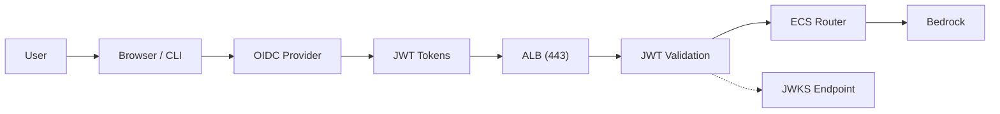

# OIDC Provider Setup Guide

## Overview

This guide explains how to configure an OIDC identity provider for opencode. The system supports any standard OIDC provider including Okta, Auth0, Azure AD, Keycloak, and AWS Cognito with federation.

## Architecture



**Authentication Flow:**
1. User attempts to access the application
2. ALB redirects to the OIDC provider for authentication (web) or CLI initiates PKCE flow
3. User logs in with their credentials
4. Provider redirects back with authorization code
5. Code is exchanged for JWT tokens (id_token, access_token, refresh_token)
6. Client sends requests with `Authorization: Bearer <token>` header
7. ALB validates JWT signature using the provider's JWKS endpoint ([details](./JWT-VALIDATION.md))
8. Valid requests are forwarded to the ECS Router

## Two Deployment Modes

### Mode 1: Cognito (with optional IdP federation)

Deploys an AWS Cognito User Pool that can federate to an external IdP (e.g., corporate SSO). Cognito handles the hosted UI and token management.

> **Important:** IdP client credentials are secrets and must be passed via environment variables, not `-c` context flags. Context flags are stored in `cdk.context.json` and may be visible in logs.

```bash
# Non-secret values via -c flags; secrets via env vars
IDP_CLIENT_ID=your-client-id \
IDP_CLIENT_SECRET=your-client-secret \
./scripts/deploy.sh -c idpName=CorporateSSO -c idpIssuer=https://sso.example.com
```

### Mode 2: External OIDC Provider

Uses a pre-configured external OIDC provider directly (no Cognito). You create the applications in your provider and pass the endpoints to CDK.

```bash
npx cdk deploy --all -c authProvider=external \
  -c oidcIssuer=https://dev-123456.okta.com/oauth2/default \
  -c oidcAlbClientId=0oaABC123 \
  -c oidcCliClientId=0oaDEF456
```

## Quick Setup

The recommended way to configure authentication is the interactive setup wizard, which handles both Cognito and external provider modes:

```bash
./scripts/setup.sh
```

For external OIDC providers specifically, you can also use the dedicated script:

```bash
./scripts/setup-oidc-provider.sh
```

## Manual Setup

### Provider-Specific Instructions

#### Okta

1. **Create ALB Application (Web):**
   - Type: Web Application
   - Grant type: Authorization Code
   - Sign-in redirect URI: `https://<your-web-domain>/oauth2/idpresponse`
   - Sign-out redirect URI: `https://<your-web-domain>/`
   - Scopes: openid, email, profile
   - Note the Client ID and Client Secret

2. **Create CLI Application (Native):**
   - Type: Native Application
   - Grant type: Authorization Code with PKCE
   - Sign-in redirect URIs: `http://localhost:19876/callback`, `http://localhost:8080/callback`
   - Scopes: openid, email, profile
   - Note the Client ID (no secret needed)

3. **Issuer URL:** `https://{your-domain}.okta.com/oauth2/default`

#### Auth0

1. **Create ALB Application (Regular Web):**
   - Type: Regular Web Application
   - Allowed Callback URLs: `https://<your-web-domain>/oauth2/idpresponse`
   - Allowed Logout URLs: `https://<your-web-domain>/`
   - Enable: Allow Cross-Origin Authentication
   - Note the Client ID and Client Secret

2. **Create CLI Application (Native):**
   - Type: Native Application
   - Allowed Callback URLs: `http://localhost:19876/callback`, `http://localhost:8080/callback`
   - Token Endpoint Authentication Method: None
   - Note the Client ID

3. **Issuer URL:** `https://{tenant}.auth0.com`

#### Azure AD

1. **Create ALB App Registration (Web):**
   - Redirect URI: `https://<your-web-domain>/oauth2/idpresponse`
   - Create a client secret
   - API permissions: openid, email, profile
   - Ensure `email` claim is in token config

2. **Create CLI App Registration (Public client):**
   - Redirect URIs: `http://localhost:19876/callback`, `http://localhost:8080/callback`
   - Enable: Allow public client flows = Yes

3. **Issuer URL:** `https://login.microsoftonline.com/{tenantId}/v2.0`

#### AWS Cognito (with federation)

Use `authProvider=cognito` mode and provide the IdP federation credentials. See Cognito mode deployment above.

### Store ALB Client Secret

The ALB OIDC authentication requires a client secret stored in AWS Secrets Manager:

```bash
aws secretsmanager create-secret \
  --name "opencode/dev/oidc-alb-client-secret" \
  --secret-string "your-alb-client-secret"
```

### Deploy

```bash
npx cdk deploy --all \
  -c authProvider=external \
  -c oidcIssuer=https://your-provider.com \
  -c oidcAlbClientId=your-alb-client-id \
  -c oidcCliClientId=your-cli-client-id
```

### Publish Distribution

After deployment:
```bash
./scripts/publish-distribution.sh
```

## Verification

1. **Check OIDC Discovery:**
   ```bash
   curl -s https://your-provider.com/.well-known/openid-configuration | jq .
   ```

2. **Test Web Authentication:**
   Open `https://<your-web-domain>` in a browser. You should be redirected to your IdP login.

3. **Test CLI Authentication:**
   ```bash
   opencode-auth login
   opencode-auth status
   ```

4. **Test API Access (protected endpoint):**
   ```bash
   # This endpoint requires a valid JWT — confirms auth is working end-to-end
   curl -H "Authorization: Bearer $(opencode-auth token)" https://<your-api-domain>/v1/models

   # Compare: /health does NOT require auth, so it's not a good auth test
   curl https://<your-api-domain>/health
   ```

## Troubleshooting

### "Invalid client_id" Error
- Verify the client ID matches your OIDC provider application
- Ensure the correct client ID is used (ALB client for web, CLI client for CLI)

### "Invalid redirect_uri" Error
- The redirect URI must match exactly what's configured in your OIDC provider
- For ALB: `https://<your-web-domain>/oauth2/idpresponse`
- For CLI: `http://localhost:19876/callback`

### "OIDC discovery failed" Error
- Verify the issuer URL is correct and accessible
- Check that `{issuer}/.well-known/openid-configuration` returns valid JSON
- Ensure network access to the OIDC provider

### Token Refresh Failures
- Ensure the refresh token hasn't expired (typically 12-24 hours)
- Run `opencode-auth login` to re-authenticate

## Related Documentation

- [JWT Validation Guide](./JWT-VALIDATION.md) - How JWT tokens are validated at the ALB level
- [Deployment Checklist](./DEPLOYMENT_CHECKLIST.md) - Complete deployment guide
