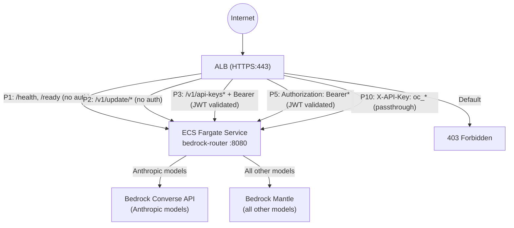
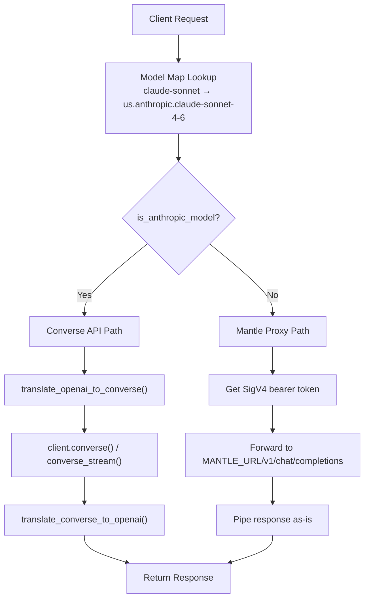
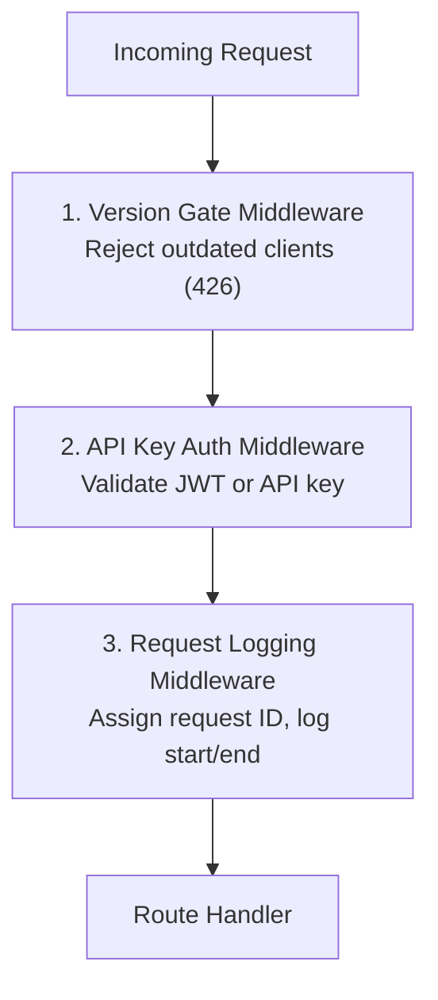
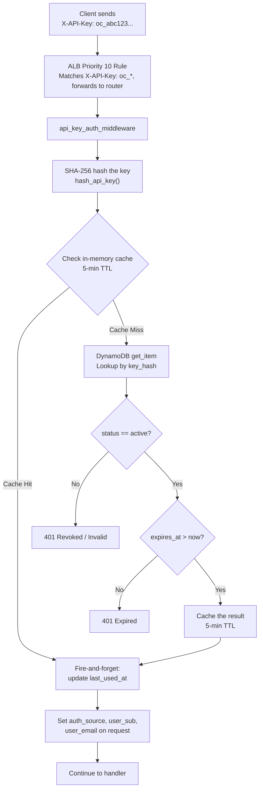

# ECS Router Deep-Dive

The ECS router is the central API gateway of the OpenCode stack. Every API request flows through it. It is a single-file Python/aiohttp application (`services/router/main.py`, ~1,700 lines) running as an ECS Fargate service behind a JWT-validating Application Load Balancer.

The router accepts [OpenAI Chat Completions API](https://platform.openai.com/docs/api-reference/chat) requests and translates them to Amazon Bedrock API calls. It handles dual-backend routing, protocol translation, SSE streaming, authentication, version enforcement, API key management, and client self-update.

**Source**: [`services/router/main.py`](../services/router/main.py)
**Infrastructure**: [`src/stacks/api-stack.ts`](../src/stacks/api-stack.ts)

---

## Table of Contents

- [Architecture](#architecture)
- [Dual-Backend Routing](#dual-backend-routing)
- [Model Mapping](#model-mapping)
- [Message Translation](#message-translation)
- [Streaming SSE Translation](#streaming-sse-translation)
- [Middleware Stack](#middleware-stack)
- [API Key Validation](#api-key-validation)
- [API Key Management Endpoints](#api-key-management-endpoints)
- [Self-Update Endpoints](#self-update-endpoints)
- [Error Handling](#error-handling)
- [Health and Readiness](#health-and-readiness)
- [Structured Logging and Observability](#structured-logging-and-observability)
- [Deployment Configuration](#deployment-configuration)
- [API Reference](#api-reference)

---

## Architecture



The router runs on ECS Fargate with:
- **CPU**: 512 (0.5 vCPU)
- **Memory**: 1024 MiB
- **Platform**: Linux/X86_64
- **Auto-scaling**: 1-3 tasks, scales at 70% CPU utilization (60s cooldown)
- **Runtime**: Python 3.14 with aiohttp

### Environment Variables

| Variable | Default | Description |
|----------|---------|-------------|
| `PORT` | `8080` | HTTP listen port |
| `LOG_LEVEL` | `INFO` | Python log level |
| `BEDROCK_MANTLE_URL` | `https://bedrock-mantle.us-east-1.api.aws` | Mantle endpoint URL |
| `SERVICE_VERSION` | `1.0.0` | Router version reported in health checks |
| `AWS_REGION` | `us-east-1` | AWS region for Bedrock and DynamoDB clients |
| `API_KEYS_TABLE_NAME` | _(required)_ | DynamoDB table name for API keys |
| `DISTRIBUTION_BUCKET` | _(optional)_ | S3 bucket for version policy and installer downloads |
| `DISTRIBUTION_DOMAIN` | _(optional)_ | CloudFront domain for download hints in 426 responses |
| `BEDROCK_MODEL_MAP` | _(optional)_ | JSON string to override the default model map |

---

## Dual-Backend Routing

The central routing decision happens in `chat_completions()` at `main.py:1424`:

```python
if is_anthropic_model(mapped_model):
    # Route to Bedrock Converse API (full translation)
else:
    # Proxy to Bedrock Mantle (passthrough)
```

### Converse API Path (Anthropic Models)

For models whose resolved Bedrock ID starts with `anthropic.` or `us.anthropic.` (`main.py:235-237`):

1. The OpenAI request body is fully translated to Converse API format via `translate_openai_to_converse()`
2. The router calls either `client.converse()` (non-streaming) or `client.converse_stream()` (streaming) using the Bedrock Runtime SDK
3. The Converse response is translated back to OpenAI format

This path handles all the complexity of protocol translation: message format conversion, tool call marshalling, image content, extended thinking, and SSE event mapping.

### Mantle Proxy Path (All Other Models)

For non-Anthropic models (e.g., Moonshot Kimi):

1. The request body is forwarded **as-is** to `MANTLE_URL/v1/chat/completions`
2. Authentication uses a SigV4 bearer token obtained via `provide_token()` (from `aws_bedrock_token_generator`), cached for 1 hour
3. The response is passed through without translation
4. Streaming responses are piped directly via `resp.content.iter_any()`
5. Timeout is 600 seconds

Mantle natively speaks the OpenAI protocol, so no translation is needed.



---

## Model Mapping

The router maps friendly model names to Bedrock model IDs. The mapping is defined in `DEFAULT_MODEL_MAP` (`main.py:188-198`) and can be overridden at runtime via the `BEDROCK_MODEL_MAP` environment variable (a JSON string).

### Current Default Model Map

| Requested Model | Bedrock Model ID |
|----------------|------------------|
| `claude-opus` | `us.anthropic.claude-opus-4-6-v1` |
| `bedrock/claude-opus` | `us.anthropic.claude-opus-4-6-v1` |
| `claude-sonnet` | `us.anthropic.claude-sonnet-4-6` |
| `bedrock/claude-sonnet` | `us.anthropic.claude-sonnet-4-6` |
| `claude-sonnet-45` | `us.anthropic.claude-sonnet-4-5-20250929-v1:0` |
| `bedrock/claude-sonnet-45` | `us.anthropic.claude-sonnet-4-5-20250929-v1:0` |
| `kimi-k25` | `moonshotai.kimi-k2.5` |
| `bedrock/kimi-k25` | `moonshotai.kimi-k2.5` |
| `bedrock/kimi-k2-thinking` | `moonshotai.kimi-k2-thinking` |

Both the short name (`claude-sonnet`) and the prefixed name (`bedrock/claude-sonnet`) are accepted for client compatibility.

### How to Add a New Model

1. **Add the mapping** to `DEFAULT_MODEL_MAP` in `main.py`:
   ```python
   DEFAULT_MODEL_MAP = {
       ...
       "my-new-model": "provider.model-id-on-bedrock",
       "bedrock/my-new-model": "provider.model-id-on-bedrock",
   }
   ```

2. **Update the IAM task role** in `src/stacks/api-stack.ts` to grant `bedrock:InvokeModel` and `bedrock:InvokeModelWithResponseStream` on the new model's ARN pattern.

3. **Determine the routing path**: If the model ID starts with `anthropic.` or `us.anthropic.`, it will use the Converse API path. Otherwise it will be proxied to Mantle.

Alternatively, set the `BEDROCK_MODEL_MAP` environment variable to a JSON string to override the entire map at runtime without code changes.

---

## Message Translation

The router translates between OpenAI Chat Completions format and Bedrock Converse API format. This is the most complex logic in the codebase, spanning `main.py:258-535`.

### Request Translation: OpenAI to Converse

`translate_openai_to_converse()` (`main.py:258-415`) converts the full request body:

#### System Messages

OpenAI system messages are extracted from the message array and placed in the Converse `system` parameter:

```
OpenAI:                              Converse API:
{                                    {
  "messages": [                        "system": [
    {                                    {"text": "You are helpful."}
      "role": "system",                ],
      "content": "You are helpful."    "messages": [...]
    },                               }
    ...
  ]
}
```

#### User and Assistant Messages

Text content is wrapped in `{"text": ...}` blocks:

```
OpenAI:                              Converse API:
{                                    {
  "role": "user",                      "role": "user",
  "content": "Hello"                   "content": [{"text": "Hello"}]
}                                    }
```

#### Tool Calls (Assistant -> Function Invocation)

OpenAI `tool_calls` on assistant messages become `toolUse` content blocks:

```
OpenAI:                              Converse API:
{                                    {
  "role": "assistant",                 "role": "assistant",
  "tool_calls": [{                     "content": [{
    "id": "call_123",                    "toolUse": {
    "type": "function",                    "toolUseId": "call_123",
    "function": {                          "name": "get_weather",
      "name": "get_weather",               "input": {"city": "Seattle"}
      "arguments": "{\"city\":\"Seattle\"}" }
    }                                  }]
  }]                                 }
}
```

Empty text blocks are stripped from assistant messages that contain tool calls, because the Converse API rejects blank text alongside `toolUse` blocks.

#### Tool Results

OpenAI `tool` role messages become `toolResult` blocks inside a `user` message. Multiple consecutive tool results are merged into a single `user` message (the Converse API requires strictly alternating roles):

```
OpenAI:                              Converse API:
[                                    {
  {                                    "role": "user",
    "role": "tool",                    "content": [
    "tool_call_id": "call_123",          {
    "content": "72F and sunny"             "toolResult": {
  },                                         "toolUseId": "call_123",
  {                                          "content": [{"text": "72F and sunny"}]
    "role": "tool",                        }
    "tool_call_id": "call_456",          },
    "content": "42F and rainy"             {
  }                                        "toolResult": {
]                                            "toolUseId": "call_456",
                                             "content": [{"text": "42F and rainy"}]
                                           }
                                         }
                                       ]
                                     }
```

#### Multi-Modal Content (Images)

Base64 data URIs are converted to Converse image blocks:

```
OpenAI:                              Converse API:
{                                    {
  "type": "image_url",                "image": {
  "image_url": {                       "format": "png",
    "url": "data:image/png;base64,..." "source": {"bytes": <decoded>}
  }                                  }
}                                    }
```

HTTP URLs are not fetched — they are passed as text placeholders (`[Image URL: ...]`) since the Converse API does not fetch external URLs.

#### Extended Thinking / Reasoning

When `reasoning_effort` or `thinking` is present in the request, the router enables Bedrock's extended thinking via `additionalModelRequestFields`:

```
OpenAI:                              Converse API:
{                                    {
  "thinking": {                        "additionalModelRequestFields": {
    "budget_tokens": 10000               "thinking": {
  }                                        "type": "enabled",
}                                          "budget_tokens": 10000
                                         }
                                       }
                                     }
```

#### Inference Configuration

| OpenAI Parameter | Converse Parameter | Notes |
|-----------------|-------------------|-------|
| `max_tokens` | `inferenceConfig.maxTokens` | |
| `temperature` | `inferenceConfig.temperature` | |
| `top_p` | `inferenceConfig.topP` | |
| `stop` | `inferenceConfig.stopSequences` | String is wrapped in array |

#### Tool Configuration

OpenAI function definitions are converted to Converse `toolSpec` format:

```
OpenAI:                              Converse API:
{                                    {
  "type": "function",                  "toolSpec": {
  "function": {                          "name": "get_weather",
    "name": "get_weather",               "description": "Get weather",
    "description": "Get weather",        "inputSchema": {
    "parameters": {                        "json": {
      "type": "object",                      "type": "object",
      "properties": {...}                    "properties": {...}
    }                                      }
  }                                      }
}                                      }
                                     }
```

When the conversation history contains `toolUse` or `toolResult` blocks but the current request does not include a `tools` array, the router synthesizes a minimal `toolConfig` from the tool names found in the history. This is required because the Converse API rejects requests with tool-related content blocks but no `toolConfig`.

### Response Translation: Converse to OpenAI

`translate_converse_to_openai()` (`main.py:458-523`) converts responses back:

| Converse Content Block | OpenAI Field |
|----------------------|--------------|
| `text` | `message.content` (joined with newlines) |
| `reasoningContent.reasoningText` | `message.reasoning_content` |
| `toolUse` | `message.tool_calls[]` with `function.name` and `function.arguments` (JSON string) |

### Stop Reason Mapping

`_map_stop_reason()` at `main.py:526-535`:

| Converse `stopReason` | OpenAI `finish_reason` |
|----------------------|----------------------|
| `end_turn` | `stop` |
| `stop_sequence` | `stop` |
| `tool_use` | `tool_calls` |
| `max_tokens` | `length` |
| `content_filtered` | `content_filter` |
| _(unknown)_ | `stop` |

### Prompt Caching

The router automatically enables [Bedrock prompt caching](https://docs.aws.amazon.com/bedrock/latest/userguide/prompt-caching.html) for all Anthropic model requests. This reduces latency and input token costs for multi-turn conversations by caching repeated content prefixes.

**How it works:**

- `cachePoint` blocks are appended to the end of system prompt blocks and tool definition arrays in `translate_openai_to_converse()`
- No configuration required -- caching is transparent and enabled by default for Anthropic models
- If the cached prefix is under the model's minimum token threshold (typically 1,024 tokens), Bedrock silently skips caching and inference proceeds normally
- Client-provided `cache_control` hints (Anthropic native format) are translated to Converse API `cachePoint` blocks

**Cache usage metrics** are surfaced in both streaming and non-streaming responses:

| Response Field | Description |
|---------------|-------------|
| `usage.prompt_tokens_details.cached_tokens` | Tokens read from cache |
| `usage.cache_read_input_tokens` | Tokens read from cache |
| `usage.cache_creation_input_tokens` | Tokens written to cache |

Structured logs include `cache_read_tokens` and `cache_write_tokens` fields for observability.

---

## Streaming SSE Translation

When `stream: true`, the router translates Converse stream events into OpenAI Server-Sent Events format.

### Implementation

`handle_anthropic_streaming()` (`main.py:575-742`):

1. Calls `client.converse_stream(**params)` in a thread pool executor
2. Wraps the synchronous boto3 `EventStream` in an async generator via `_iter_stream_events()` (`main.py:745-756`)
3. Translates each Converse event to an OpenAI `chat.completion.chunk` SSE frame
4. Writes each frame as `data: {json}\n\n` via `_write_sse()`
5. Terminates with `data: [DONE]\n\n`

### Event Mapping

| Converse Event | SSE Chunk Delta | Description |
|---------------|----------------|-------------|
| `messageStart` | `{"role": "assistant", "content": ""}` | Announces the assistant role |
| `contentBlockStart` (toolUse) | `{"tool_calls": [{"index": N, "id": "...", "type": "function", "function": {"name": "...", "arguments": ""}}]}` | Start of a tool call |
| `contentBlockDelta` (text) | `{"content": "..."}` | Text token |
| `contentBlockDelta` (reasoningContent) | `{"reasoning_content": "..."}` | Thinking/reasoning token |
| `contentBlockDelta` (toolUse) | `{"tool_calls": [{"index": N, "function": {"arguments": "..."}}]}` | Tool call argument fragment |
| `messageStop` | `finish_reason` set | End of message with stop reason |
| `metadata` | `usage` object | Token usage statistics |

### Example SSE Sequence

```
data: {"id":"chatcmpl-abc123","object":"chat.completion.chunk","model":"us.anthropic.claude-sonnet-4-6","choices":[{"index":0,"delta":{"role":"assistant","content":""}}]}

data: {"id":"chatcmpl-abc123","object":"chat.completion.chunk","model":"us.anthropic.claude-sonnet-4-6","choices":[{"index":0,"delta":{"content":"Hello"}}]}

data: {"id":"chatcmpl-abc123","object":"chat.completion.chunk","model":"us.anthropic.claude-sonnet-4-6","choices":[{"index":0,"delta":{"content":"!"}}]}

data: {"id":"chatcmpl-abc123","object":"chat.completion.chunk","model":"us.anthropic.claude-sonnet-4-6","choices":[{"index":0,"delta":{},"finish_reason":"stop"}]}

data: {"id":"chatcmpl-abc123","object":"chat.completion.chunk","model":"us.anthropic.claude-sonnet-4-6","choices":[{"index":0,"delta":{}}],"usage":{"prompt_tokens":10,"completion_tokens":2,"total_tokens":12}}

data: [DONE]
```

### Error Handling During Streaming

If an error occurs after the stream has started (HTTP headers already sent), the router:
1. Sends the error as an SSE data frame: `data: {"error": {"message": "...", "type": "server_error", "code": "bedrock_error"}}`
2. Sends `data: [DONE]`
3. Closes the stream

This ensures clients always receive a well-formed SSE stream.

### Mantle Streaming

For non-Anthropic models, streaming is a simple passthrough. The router pipes chunks directly from Mantle's response via `resp.content.iter_any()`. The last SSE data line is tracked for usage diagnostics logging.

---

## Middleware Stack

Three middlewares execute in order on every request (`main.py:1668-1674`):



### 1. Version Gate Middleware

**Source**: `main.py:109-184`

Enforces a minimum client version by checking the `X-Client-Version` header against a version policy stored in S3.

**Skip rules** — the following paths bypass the version gate:
- `/health`, `/ready` (health checks)
- `/v1/update/*` (self-update endpoints — blocked clients must be able to update themselves)

**Behavior**:
- No `X-Client-Version` header: **allowed** (backward compatibility)
- `X-Client-Version: dev`: **allowed** (development builds)
- Version below minimum: **rejected** with HTTP `426 Upgrade Required`
- Unparseable version: **allowed** (fail-open)

**Version policy cache**:
- Fetched from `s3://{DISTRIBUTION_BUCKET}/downloads/version.json`
- Cached in memory for 5 minutes (`VERSION_POLICY_TTL = 300`)
- Contains a `minimum` field with a semver string (e.g., `"1.2.0"`)

**426 Response body**:
```json
{
  "error": {
    "message": "Your opencode-auth client (v1.0.0) is below the minimum required version (v1.2.0). Run the following to update:\n\n  opencode-auth update && oc\n\nOr download the latest installer from:\n\n  https://downloads.example.com",
    "type": "version_error",
    "code": "client_outdated",
    "minimum_version": "1.2.0",
    "your_version": "1.0.0",
    "update_command": "opencode-auth update && oc"
  }
}
```

### 2. API Key Auth Middleware

**Source**: `main.py:843-965`

Validates authentication for non-health, non-update requests.

**Skip rules** — the following paths bypass auth:
- `/health`, `/ready` (health checks)
- `/v1/api-keys*` (management endpoints — handled separately)
- `/v1/update/*` (self-update endpoints)

**Dual-mode authentication**:

| Auth Method | Header | Validation |
|------------|--------|------------|
| JWT | `Authorization: Bearer <token>` | Already validated by ALB. Middleware decodes payload (without signature verification) to extract `sub` and `email` for logging. |
| API Key | `X-API-Key: oc_<random>` | Validated by the router against DynamoDB. See [API Key Validation](#api-key-validation). |

If neither header is present, the middleware returns `401` with `"missing_credentials"`.

### 3. Request Logging Middleware

**Source**: `main.py:1327-1384`

Assigns a request ID and logs request lifecycle.

- **Request ID**: Propagates `X-Request-ID` from the incoming request, or generates a UUID if absent. Added to all response headers.
- **Health endpoints**: Minimal processing (assigns ID, returns) — no verbose logging to reduce noise.
- **All other endpoints**: Logs `Request started` with method, path, user_agent on entry; logs `Request completed` with method, path, status, `duration_ms` on exit.

---

## API Key Validation

**Source**: `main.py:781-985`

The full API key validation flow:



### Key Format

- Prefix: `oc_`
- Random part: `secrets.token_urlsafe(32)` (43 characters of base64url)
- Full key: `oc_` + 43 chars = 46 characters total
- Storage: SHA-256 hex digest of the full key (the plaintext key is never stored)

### DynamoDB Table Schema

**Table**: `opencode-api-keys-{env}`

| Attribute | Type | Key | Description |
|-----------|------|-----|-------------|
| `key_hash` | String | Partition key | SHA-256 hex digest |
| `key_prefix` | String | | First 10 chars (e.g., `oc_abc1234`) |
| `user_sub` | String | GSI partition key | Cognito user sub |
| `user_email` | String | | User's email |
| `description` | String | | User-provided label |
| `status` | String | | `active` or `revoked` |
| `created_at` | String | GSI sort key | ISO 8601 timestamp |
| `expires_at` | String | | ISO 8601 timestamp |
| `last_used_at` | String | | ISO 8601 timestamp (fire-and-forget updates) |
| `revoked_at` | String | | ISO 8601 timestamp (set on revocation) |
| `ttl` | Number | | DynamoDB TTL: expiry + 30 days |

**GSI**: `user-sub-index` (partition: `user_sub`, sort: `created_at`, projection: ALL)

### Cache Behavior

- **In-memory cache**: Dictionary keyed by `key_hash`, stores `user_sub`, `user_email`, and `cache_expires`
- **TTL**: 5 minutes (`_API_KEY_CACHE_TTL = 300`)
- **Invalidation**: Explicit removal on key revocation (`_api_key_cache.pop()`)
- **Note**: Cache means a revoked key may remain valid for up to 5 minutes on a given router task

---

## API Key Management Endpoints

Three JWT-protected endpoints for key lifecycle management. These require JWT authentication (enforced by ALB priority 3 rule), not API key auth.

### POST /v1/api-keys

Create a new API key.

**Request**:
```json
{
  "description": "CI pipeline key",
  "expires_in_days": 90
}
```

**Constraints**:
- `expires_in_days`: 1-365 (default: 90)
- Maximum 10 active keys per user

**Response** (201):
```json
{
  "key": "oc_abc123...",
  "key_prefix": "oc_abc1234",
  "description": "CI pipeline key",
  "status": "active",
  "created_at": "2026-02-20T00:00:00+00:00",
  "expires_at": "2026-05-21T00:00:00+00:00"
}
```

The full key is returned **only once** in this response. It is stored as a SHA-256 hash and cannot be retrieved again.

### GET /v1/api-keys

List the current user's API keys. Never returns the full key — only the prefix.

**Response** (200):
```json
{
  "keys": [
    {
      "key_prefix": "oc_abc1234",
      "description": "CI pipeline key",
      "status": "active",
      "created_at": "2026-02-20T00:00:00+00:00",
      "expires_at": "2026-05-21T00:00:00+00:00",
      "last_used_at": "2026-02-20T12:30:00+00:00"
    }
  ]
}
```

### DELETE /v1/api-keys/{key_prefix}

Revoke a key by its prefix. Uses a DynamoDB `ConditionExpression` on `user_sub` to prevent cross-user revocation.

**Response** (200):
```json
{
  "status": "revoked",
  "key_prefix": "oc_abc1234"
}
```

The in-memory cache entry is immediately invalidated on the task that processed the revocation.

---

## Self-Update Endpoints

Two unauthenticated endpoints that allow clients (including those with expired tokens or outdated versions) to update themselves. These bypass both ALB JWT validation (priority 2 rule) and the router's auth middleware.

### GET /v1/update/download-url

**Source**: `main.py:1576-1615`

Returns a presigned S3 URL for the installer package.

**Response** (200):
```json
{
  "download_url": "https://s3.amazonaws.com/bucket/downloads/opencode-installer.zip?...",
  "expires_in": 3600
}
```

The presigned URL is valid for 1 hour. The S3 object key is `downloads/opencode-installer.zip`.

### GET /v1/update/config

**Source**: `main.py:1618-1664`

Returns a config patch that clients can apply to update their local configuration.

**Response** (200): The raw JSON content of `downloads/config-patch.json` from S3.

**Response** (404): If no config patch has been published:
```json
{
  "error": {
    "message": "No config patch published yet",
    "type": "not_found"
  }
}
```

### Why Unauthenticated?

These endpoints are intentionally unauthenticated at both the ALB and application level. A client whose JWT has expired or whose version is below the minimum cannot authenticate — but it still needs to download an update. The ALB listener rule at priority 2 forwards `/v1/update/*` requests directly to the router without JWT validation.

---

## Error Handling

The router returns errors in OpenAI-compatible format across all paths.

### Non-Streaming Errors (Converse API)

**Source**: `main.py:556-572`

When `client.converse()` fails, the router returns HTTP 502 with a generic error message. The specific error is logged server-side but not exposed to the client:

```json
{
  "error": {
    "message": "An internal error occurred while processing the request.",
    "type": "server_error",
    "code": "bedrock_error"
  }
}
```

### Streaming Errors (Converse Stream)

**Source**: `main.py:722-742`

When an error occurs after streaming has started, the router sends the error as an SSE frame followed by the `[DONE]` sentinel:

```
data: {"error":{"message":"An internal error occurred while processing the stream.","type":"server_error","code":"bedrock_error"}}

data: [DONE]
```

### Mantle Errors

For non-Anthropic models, the Mantle response status and body are passed through as-is. If the connection to Mantle fails entirely (`aiohttp.ClientError`), the router returns HTTP 502:

```json
{"error": "Upstream service unavailable"}
```

### Authentication Errors

| Scenario | Status | Code |
|----------|--------|------|
| No credentials | 401 | `missing_credentials` |
| Invalid API key | 401 | `invalid_api_key` |
| Revoked API key | 401 | `revoked_api_key` |
| Expired API key | 401 | `expired_api_key` |
| DynamoDB lookup failure | 500 | `internal_error` |

### Version Gate Errors

| Scenario | Status | Code |
|----------|--------|------|
| Client version below minimum | 426 | `client_outdated` |

---

## Health and Readiness

### GET /health

**Source**: `main.py:1283-1292`

Basic ALB health check. Returns immediately without external dependencies.

```json
{
  "status": "healthy",
  "service": "bedrock-router",
  "version": "1.0.0",
  "timestamp": "2026-02-20T00:00:00Z"
}
```

The ALB target group health check hits this endpoint on port 8080 every 30 seconds, with a 10-second timeout. 2 consecutive successes = healthy; 3 consecutive failures = unhealthy.

### GET /ready

**Source**: `main.py:1295-1316`

Deep health check that validates the router can obtain a Mantle authentication token. Returns 503 if token generation fails:

```json
{"status": "not_ready", "error": "Token generation failed"}
```

### GET /v1/models

**Source**: `main.py:1319-1324`

Lists available models from the model map in OpenAI format:

```json
{
  "object": "list",
  "data": [
    {"id": "claude-opus", "object": "model", "owned_by": "bedrock"},
    {"id": "claude-sonnet", "object": "model", "owned_by": "bedrock"},
    ...
  ]
}
```

---

## Structured Logging and Observability

### JSON Formatter

**Source**: `main.py:29-44`

All logs are output as single-line JSON for CloudWatch ingestion. The custom `JSONFormatter` captures:

- `timestamp`: ISO 8601 UTC
- `level`: Log level (INFO, WARNING, ERROR)
- `logger`: Always `bedrock-router`
- `message`: Log message
- **Extra fields**: Any `extra={...}` dict passed to the logger (e.g., `request_id`, `model`, `duration_ms`)
- `traceback`: Stack trace from `log.exception()` calls

### Example Log Lines

**Request start**:
```json
{"timestamp":"2026-02-20T00:00:00Z","level":"INFO","logger":"bedrock-router","message":"Request started","request_id":"abc-123","method":"POST","path":"/v1/chat/completions","user_agent":"opencode-auth/1.2.0"}
```

**Request complete**:
```json
{"timestamp":"2026-02-20T00:00:01Z","level":"INFO","logger":"bedrock-router","message":"Request completed","request_id":"abc-123","method":"POST","path":"/v1/chat/completions","status":200,"duration_ms":1234}
```

**Routing decision**:
```json
{"timestamp":"2026-02-20T00:00:00Z","level":"INFO","logger":"bedrock-router","message":"Routing decision","request_id":"abc-123","requested_model":"claude-sonnet","mapped_model":"us.anthropic.claude-sonnet-4-6","route":"converse"}
```

### CloudWatch Logs Insights Queries

**Find slow requests** (> 5 seconds):
```
fields @timestamp, request_id, path, duration_ms, model
| filter message = "Request completed" and duration_ms > 5000
| sort duration_ms desc
| limit 50
```

**Find requests for a specific model**:
```
fields @timestamp, request_id, route, duration_ms
| filter message = "Routing decision" and requested_model = "claude-opus"
| sort @timestamp desc
| limit 50
```

**Find authentication failures**:
```
fields @timestamp, request_id, message, path
| filter level = "WARNING" or (message like /auth/ and level = "ERROR")
| sort @timestamp desc
| limit 50
```

**Find Bedrock errors**:
```
fields @timestamp, request_id, message, error, type
| filter message like /failed/ and level = "ERROR"
| sort @timestamp desc
| limit 50
```

**Find version gate rejections**:
```
fields @timestamp, client_version, minimum_version, path
| filter message = "Client version rejected"
| sort @timestamp desc
| limit 50
```

**Stream usage per model** (token tracking):
```
fields @timestamp, request_id, model, prompt_tokens, completion_tokens, total_tokens
| filter message = "Stream usage emitted"
| stats sum(total_tokens) as total, count(*) as requests by model
```

---

## Deployment Configuration

### ECS Fargate Service

| Setting | Value | Source |
|---------|-------|--------|
| Service name | `bedrock-router-{env}` | `api-stack.ts:609` |
| Desired count | 1 | `api-stack.ts:610` |
| Subnets | Private | `api-stack.ts:612-614` |
| Public IP | No | `api-stack.ts:611` |
| Circuit breaker | Enabled with rollback | `api-stack.ts:616-618` |
| Health check grace period | 120 seconds | `api-stack.ts:619` |

### Auto-Scaling

| Setting | Value |
|---------|-------|
| Min capacity | 1 task |
| Max capacity | 3 tasks |
| Scale metric | CPU utilization |
| Target | 70% |
| Scale-in cooldown | 60 seconds |
| Scale-out cooldown | 60 seconds |

### ALB Configuration

| Setting | Value |
|---------|-------|
| ALB name | `opencode-jwt-{env}` |
| Internet-facing | Yes |
| Idle timeout | 900 seconds (for long-running Claude thinking requests) |
| HTTP/2 | Enabled |
| Drop invalid headers | Enabled |
| Default action | 403 Forbidden |

### Graceful Shutdown

**Source**: `main.py:1551-1568`

The router handles `SIGTERM` and `SIGINT` for graceful ECS shutdown:
1. Signal handler calls `app.shutdown()`
2. `on_shutdown` callback shuts down the `ThreadPoolExecutor`
3. aiohttp drains in-flight requests

### Container Health Check

The ECS task definition includes a container-level health check (in addition to the ALB target group check):

```
CMD-SHELL python -c "import urllib.request; urllib.request.urlopen('http://localhost:8080/health')" || exit 1
```

- Interval: 30 seconds
- Timeout: 5 seconds
- Retries: 3
- Start period: 10 seconds

### IAM Permissions

The task role (`api-stack.ts:326-376`) grants:

| Permission | Resources |
|------------|-----------|
| `bedrock:InvokeModel`, `bedrock:InvokeModelWithResponseStream` | `foundation-model/anthropic.*`, `foundation-model/moonshotai.*`, `inference-profile/us.anthropic.*`, `inference-profile/us.moonshotai.*` |
| `bedrock-mantle:CreateInference`, `bedrock-mantle:CallWithBearerToken` | Mantle project default + `*` |
| DynamoDB read/write | `opencode-api-keys-{env}` table + indexes |
| `s3:GetObject` | `{distribution-bucket}/downloads/*` |

---

## API Reference

### Complete Route Table

| Method | Path | Handler | Auth | Description |
|--------|------|---------|------|-------------|
| GET | `/health` | `health` | None | Basic ALB health check |
| GET | `/ready` | `ready` | None | Deep health check (validates Mantle token) |
| GET | `/v1/models` | `models` | JWT or API key | List available models |
| POST | `/v1/chat/completions` | `chat_completions` | JWT or API key | Chat completion (routes to Converse or Mantle) |
| POST | `/v1/api-keys` | `create_api_key` | JWT only | Create a new API key |
| GET | `/v1/api-keys` | `list_api_keys` | JWT only | List user's API keys |
| DELETE | `/v1/api-keys/{key_prefix}` | `revoke_api_key` | JWT only | Revoke an API key |
| GET | `/v1/update/download-url` | `update_download_url` | None | Get presigned installer URL |
| GET | `/v1/update/config` | `update_config` | None | Get config patch |

### ALB Listener Rule Priority Chain

| Priority | Condition | Auth Action | Description |
|----------|-----------|-------------|-------------|
| 1 | `/health`, `/health/*`, `/ready` | Forward (no auth) | Health checks |
| 2 | `/v1/update/*` | Forward (no auth) | Self-update for expired/blocked clients |
| 3 | `/v1/api-keys*` + `Authorization: Bearer*` | JWT validation, then forward | API key management |
| 5 | `Authorization: Bearer*` | JWT validation, then forward | General authenticated requests |
| 10 | `X-API-Key: oc_*` | Forward (app validates) | API key authenticated requests |
| Default | _(none matched)_ | 403 Forbidden | Reject unauthenticated requests |

---

## Related Documentation

- [Local Proxy](./LOCAL-PROXY.md) — The `opencode-auth` proxy that sits between the CLI and this router, handling token injection and refresh
- [JWT Validation](./JWT-VALIDATION.md) — ALB JWT validation rules and JWKS configuration
- [Deployment Checklist](./DEPLOYMENT_CHECKLIST.md) — Steps for deploying the full stack including the router
