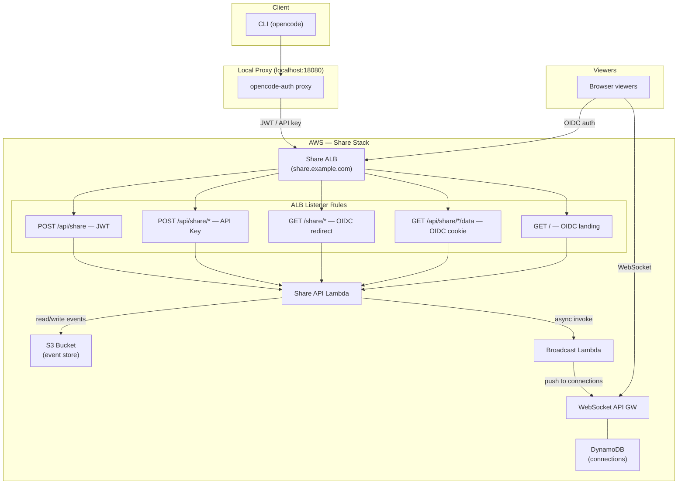
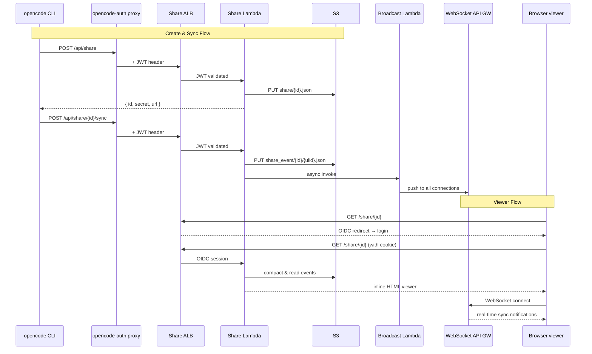
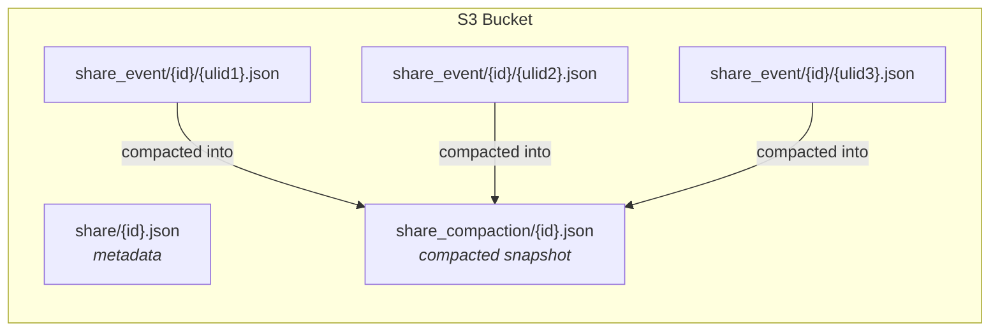
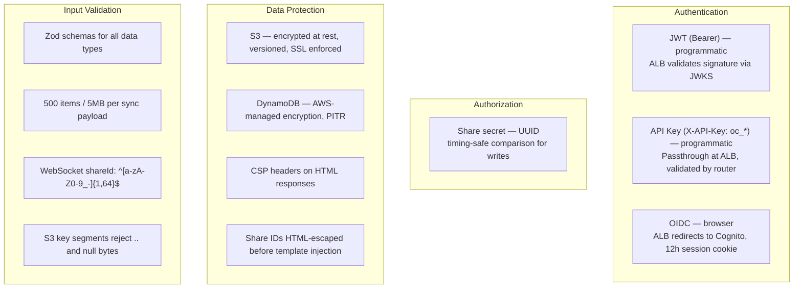

# OpenCode Share Feature

## Overview

The share feature allows authenticated users to create shareable links to their OpenCode coding sessions, with real-time WebSocket updates. It deploys as an optional CDK stack with a dedicated ALB, Lambda functions, S3 event store, and WebSocket API Gateway.

## Architecture



### Request Flow



### Components

#### 1. Share Lambda API (`services/share/lambda/`)
- **Router** (`src/index.ts`): Routes requests based on path and HTTP method; supports both ALB v1 and API Gateway v2 event formats
- **Handlers** (`src/handlers.ts`): CRUD operations, inline HTML viewer with XSS protection and CSP headers, landing page, health check
- **Business Logic** (`src/share.ts`): Event-sourcing with compaction, timing-safe secret comparison, Zod schema validation, payload limits (500 items / 5MB)
- **Storage** (`src/storage.ts`): S3 storage adapter with pagination support and path-traversal prevention

#### 2. WebSocket Handlers (`services/share/websocket/`)
- **connect.ts**: Stores WebSocket connection in DynamoDB with 24h TTL and shareId validation
- **disconnect.ts**: Removes connection from DynamoDB
- **default.ts**: Handles `subscribe` (re-subscribe to different shareId) and `ping` actions
- **broadcast.ts**: Fans out sync notifications to all connections for a share; cleans up stale connections (410 GoneException)

#### 3. Standalone Viewer (`services/share/viewer/`)
- `index.html` — Viewer page shell
- `viewer.js` — Client-side rendering logic (markdown, code blocks, diffs, tool calls)
- `styles.css` — Responsive styling with dark mode support

> **Note**: The standalone viewer is a reference/development asset. Production uses the inline HTML viewer generated by the Share Lambda's `viewShareHandler`.

#### 4. CDK Stack (`src/stacks/share-stack.ts`)
Single optional stack containing all share resources:
- S3 bucket (event store, encrypted, versioned, lifecycle rules — events expire after 90 days)
- DynamoDB table (WebSocket connections, AWS-managed encryption, TTL, PITR)
- Share API Lambda (Node.js 20)
- 4 WebSocket Lambdas (connect, disconnect, default, broadcast)
- WebSocket API Gateway (with throttling: burst 1000, rate 500)
- Dedicated internet-facing ALB with 5 listener rules (JWT, API key, OIDC)
- Route53 A record for the share domain
- CloudWatch alarms for Lambda errors and throttles
- SSM parameters for cross-stack references

## API Endpoints

All endpoints are served by a **dedicated Share ALB** with its own domain (e.g., `share.example.com`).

### Programmatic Access (JWT / API Key auth)

| Method | Path | Description | Auth |
|--------|------|-------------|------|
| `POST` | `/api/share` | Create a new share | JWT or API key |
| `POST` | `/api/share/{id}/sync` | Sync session data | JWT or API key |
| `GET` | `/api/share/{id}/data` | Get share data | JWT or API key |
| `DELETE` | `/api/share/{id}` | Delete a share | JWT or API key |

### Browser Access (OIDC auth)

| Method | Path | Description | Auth |
|--------|------|-------------|------|
| `GET` | `/` | Landing page with usage instructions | OIDC redirect |
| `GET` | `/share/{id}` | View shared session (inline HTML) | OIDC redirect |
| `GET` | `/api/share/{id}/data` | Get share data (viewer fetch) | OIDC cookie |

## Data Model

The share feature uses an **event-sourcing** pattern with S3:



### S3 Key Patterns

| Key Pattern | Content |
|-------------|---------|
| `share/{id}.json` | Share metadata (`id`, `secret`, `sessionID`) |
| `share_event/{id}/{ulid}.json` | Append-only event log entry (`Data[]`) |
| `share_compaction/{id}.json` | Compacted snapshot for fast reads (`{ event?, data: Data[] }`) |

### Data Types

| Type | Description | Merge Key |
|------|-------------|-----------|
| `session` | Session metadata (title, version, timestamps) | `"session"` |
| `message` | Chat messages with role, id, time | `"message/{id}"` |
| `part` | Message parts (text, code, tool calls, reasoning) | `"{messageID}/{id}"` |
| `model` | Model information | `"model"` |
| `session_diff` | Code diffs | `"session_diff"` |

### Compaction

On read, the Lambda compacts all events since the last bookmark into a single snapshot using binary search and type-specific merge logic. For text/reasoning parts, the **longest text** is kept (streaming merge).

## Deployment

### Prerequisites

- All base stacks deployed (Network, Certificate, Auth, API, Distribution)
- Node.js 20+ for Lambda runtime

### Deploy with CDK

```bash
# Build Lambda code first
cd services/share/lambda && npm install && npm run build && cd -
cd services/share/websocket && npm install && npm run build && cd -

# Deploy share stack (optional feature flag)
npx cdk deploy OpenCodeShare-dev -c enableShareFeature=true

# Deploy without share (default)
npx cdk deploy --all
```

### Configure opencode-auth

Add the share endpoint to `~/.opencode/config.json`:

```json
{
  "client_id": "...",
  "api_endpoint": "https://oc.example.com/v1",
  "share_endpoint": "https://share.example.com"
}
```

The `opencode-auth` proxy registers three route patterns when `share_endpoint` is configured:
- `/api/share` — create share
- `/api/share/*` — sync, data, delete
- `/share/*` — viewer (browser)

All requests are reverse-proxied to the share endpoint with JWT authentication injected.

## Configuration

### Environment Variables (Share API Lambda)

| Variable | Description |
|----------|-------------|
| `OPENCODE_STORAGE_BUCKET` | S3 bucket name for share data |
| `OPENCODE_STORAGE_REGION` | AWS region for S3 |
| `BROADCAST_LAMBDA_ARN` | ARN of the WebSocket broadcast Lambda |
| `API_GATEWAY_URL` | Base URL for the API (used in inline viewer) |
| `SHARE_VIEWER_BASE_URL` | Base URL for share links (used in create response) |
| `CORS_ALLOWED_ORIGIN` | Allowed CORS origin (defaults to share domain) |
| `NODE_ENV` | Environment (`production` / `test`) |

### Environment Variables (WebSocket Lambdas)

| Variable | Description |
|----------|-------------|
| `CONNECTIONS_TABLE` | DynamoDB table name for WebSocket connections |
| `API_GATEWAY_ENDPOINT` | WebSocket API Gateway endpoint (default + broadcast only) |

### CDK Context

| Context Key | Default | Description |
|-------------|---------|-------------|
| `enableShareFeature` | `'false'` | Set to `'true'` to deploy the share stack |

## Security



- **Programmatic routes** (`/api/share/*`): JWT validation via ALB JWKS or API key passthrough
- **Browser routes** (`/share/*`, `/`): OIDC redirect via ALB with 12-hour session cookies
- **Share writes** (sync/delete): Require share secret (UUID, timing-safe comparison)
- **S3**: Encrypted at rest (S3-managed), versioned, public access blocked, SSL enforced
- **DynamoDB**: AWS-managed encryption, point-in-time recovery, TTL for connection cleanup
- **WebSocket shareId**: Validated against `^[a-zA-Z0-9_-]{1,64}$` pattern
- **XSS protection**: Share IDs HTML-escaped before template injection, CSP headers on viewer
- **Input validation**: Zod schemas for all data types; sync payloads capped at 500 items / 5MB
- **IAM**: Lambda invoke scoped to specific broadcast Lambda ARN
- **CORS**: Restricted to configured share domain

## Testing

Tests are in the `test/` directory:

| File | Tests | Coverage |
|------|-------|---------|
| `share-lambda.test.ts` | ~25 | Business logic (create/sync/remove, schema validation), all 7 handlers, router path matching, ALB path parameter extraction |
| `share-stack.test.ts` | ~15 | CDK stack synthesis: S3, DynamoDB, Lambda count, WebSocket API, ALB, listener rules, alarms, SSM params |
| `share-websocket.test.ts` | ~12 | WebSocket handler input validation, error handling, connect/disconnect/default/broadcast |

```bash
# Run share tests
npx jest test/share-lambda.test.ts test/share-stack.test.ts test/share-websocket.test.ts
```
